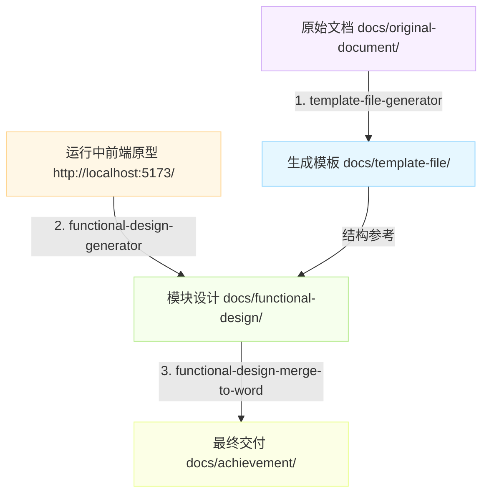

# 产品初步设计自动化系统 (Product Preliminary Design)

本项目是一个由 AI 驱动的产品初步设计与系统规格文档自动化生成体系。通过将大模型自定义技能（Skills）与文档工程自动化流程深度结合，打通了从**上游原始设计文档提取骨架模板**、**深度探索前端运行中 UI 原型并截屏/提取控件字段**、**生成标准化功能设计 (PRD)**，到最终**一键图表渲染、边框修饰并输出交付级 Word (.docx) 文档**的完整工程闭环。

---

## 📁 目录架构说明

项目采用严格规范的层次化目录结构，各阶段产出职责明确：

```text
product-preliminary-design/
├── .agents/                               # AI 智能体与自动化能力配置
│   └── skills/                            # 本项目三大核心处理技能
│       ├── template-file-generator/       # 技能 1：Word 结构解析与骨架模板抽取
│       ├── functional-design-generator/   # 技能 2：UI 原型探索与四要素功能设计生成
│       └── functional-design-merge-to-word/# 技能 3：按序合并、图表渲染与 Word 交付级导出
├── docs/                                  # 项目核心业务文档库
│   ├── original-document/                 # 【输入】上游原始设计文档（如《概要设计说明书.docx》）
│   ├── template-file/                     # 【模板】解析生成的 Markdown 骨架模板
│   │   ├── 概要设计模板.md                # 包含各章节占位符的总模板
│   │   ├── 1_业务概况.md                  # 分章节子模板：业务流程清单与说明
│   │   ├── 2_功能设计.md                  # 分章节子模板：功能清单与典型模块推导范式
│   │   ├── 3_数据库设计.md                # 分章节子模板：数据表清单与 ER 图
│   │   └── 4_接口设计.md                  # 分章节子模板：API 接口与参数规范
│   ├── functional-design/                 # 【分模块设计】针对各业务模块生成的具体功能设计 MD
│   │   └── 系统管理/                      # 示例：系统管理模块（包含 8 个独立子功能文档）
│   │       ├── 用户管理.md
│   │       ├── 角色管理.md
│   │       ├── 菜单管理.md
│   │       ├── 部门管理.md
│   │       ├── 岗位管理.md
│   │       ├── 字典管理.md
│   │       ├── 参数设置.md
│   │       └── 通知公告.md
│   ├── achievement/                       # 【交付物】最终整合导出的正式成果
│   │   ├── 2_功能设计-系统管理.md          # 完整汇总的 Markdown 设计文档
│   │   └── 2_功能设计-系统管理.docx        # 格式化、带边框、含图表渲染的 Word 交付文件
│   ├── assets/                            # 【静态资源库】UI 交互截图与自动生成的流程渲染图
│   └── prompt-sample/                     # 【提示词库】与 AI 协作的标准化 Prompt 样例
└── README.md                              # 项目总说明文档
```

---

## 🛠️ 三大核心自动化技能 (Core Skills)

项目内置了专门针对产品设计规范定制的 AI 技能体系：

### 1. `template-file-generator`（模板文件生成器）
- **核心定位**：从 `.docx` 格式的需求或概要设计说明书中提取标题骨架。
- **关键机制**：
  - 自动剥离旧有数据与冗余段落，根据标题层级注入标准化设计表格与占位符。
  - **单示例推导范式**：在【功能设计】章节避免冗长地列举所有功能，仅保留首个一级/二级功能作为标准四要素示例，后续模块依此推导。
  - **一主四子自动拆分**：一次执行即可同步生成总模板 `概要设计模板.md` 与 4 个分章节子模板（`1_业务概况.md`、`2_功能设计.md`、`3_数据库设计.md`、`4_接口设计.md`）。

### 2. `functional-design-generator`（原型探索与功能设计生成）
- **核心定位**：连接运行中的 UI 原型（如 `http://localhost:5173/`），自动抓取界面并产出标准功能文档。
- **关键机制**：
  - 调度 `browser_subagent` 深度探索原型页面，自动操作“新增”、“修改”、“更多”等按钮打开弹窗或抽屉，截取高清交互截图。
  - 自动分析真实 DOM，提取搜索区、操作按钮、数据表格等控件规则与字段属性。
  - 严格输出**功能设计四要素**：
    1. **页面原型**（清晰嵌入本地截图）
    2. **功能说明**（详细流转与交互规则）
    3. **页面控件**（五列表格：名称/类型/位置/事件/说明）
    4. **页面字段**（七列表格：名称/数据类型/长度/允许操作/是否必输/录入方式/备注）

### 3. `functional-design-merge-to-word`（按序合并与交付级 Word 导出）
- **核心定位**：将多个离散的模块 Markdown 整合并转换为符合交付标准的 Word 文档。
- **关键机制**：
  - **按原型菜单顺序编排**：支持 `--order` 参数，严格保证生成的大纲及“功能清单”表格与系统界面导航顺序一致（如：用户管理 ➔ 角色管理 ➔ 菜单管理 ➔ ...）。
  - **流程图自动图表化**：提取文档中的 Mermaid 业务流程图代码，自动渲染为高清 PNG 并替换为图片链接，彻底解决 Word 无法直接渲染 Mermaid 图形的问题。
  - **段落与换行自适应**：智能优化“业务流程说明”的分行结构，杜绝 Pandoc 转换中有序列表被折叠压缩为单行的问题，确保各项独立成行。
  - **表格全边框注入**：调用 `python-docx` 遍历 OXML 结构，为文档中的全部表格强制注入标准的黑色实线网格边框（`Table Grid`）。

---

## 🔄 标准化端到端工作流 (Workflow)



### 步骤一：提取模板骨架
```powershell
python .agents/skills/template-file-generator/scripts/generate_template.py `
  --input "docs\original-document\概要设计说明书.docx" `
  --output "docs\template-file\概要设计模板.md"
```

### 步骤二：结合原型生成模块功能设计
告知 AI 助手连接正在运行的前端原型地址，并针对具体业务模块进行探索：
> “结合原型项目 http://localhost:5173/，使用 functional-design-generator 技能，生成 系统管理 下各模块的详细功能设计。”

### 步骤三：按序合并并导出交付级 Word
```powershell
python .agents/skills/functional-design-merge-to-word/scripts/merge_to_word.py `
  --input_dir "docs\functional-design\系统管理" `
  --output_md "docs\achievement\2_功能设计-系统管理.md" `
  --output_docx "docs\achievement\2_功能设计-系统管理.docx" `
  --module_name "系统管理" `
  --order "用户管理,角色管理,菜单管理,部门管理,岗位管理,字典管理,参数设置,通知公告"
```

---

## 🏆 当前交付成果展示 (Current Deliverables)

以当前已落地的 **系统管理** 模块为例：
- **功能清单覆盖**：涵盖 8 个完整子模块（用户管理、角色管理、菜单管理、部门管理、岗位管理、字典管理、参数设置、通知公告）。
- **产出成果**：
  - 📄 **Word 交付件**：[2_功能设计-系统管理.docx](file:///d:/person/project/product-preliminary-design/docs/achievement/2_功能设计-系统管理.docx)
    - 46 个完整注入标准边框的控件与字段表格；
    - 24 张高清弹窗与交互原型截图；
    - 8 张业务流转渲染图。
  - 📝 **Markdown 完整件**：[2_功能设计-系统管理.md](file:///d:/person/project/product-preliminary-design/docs/achievement/2_功能设计-系统管理.md)

---

## ⚙️ 环境与规范说明

1. **环境依赖**：
   - **Python 3.8+**
   - **Pandoc**：用于 Markdown 到 Word 的编译转换（需安装并配置系统 PATH）。
   - **python-docx**：用于处理表格边框注入（`pip install python-docx`）。
2. **编码与安全原则**：
   - 所有文本、Markdown 及脚本文件均**严格强制采用无 BOM 的 UTF-8 编码**（`utf-8`），杜绝 Windows PowerShell 默认编码导致的中文乱码。
   - 文件写入严格通过脚本或工具完成，避免使用 `>` 或 `>>` 造成字符集污染。
