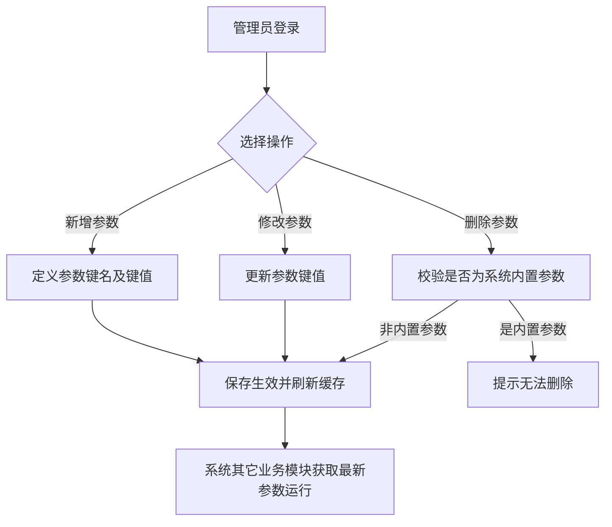
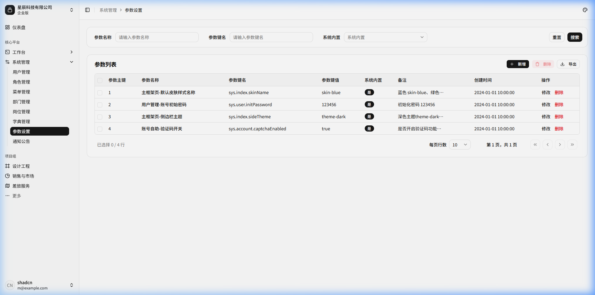
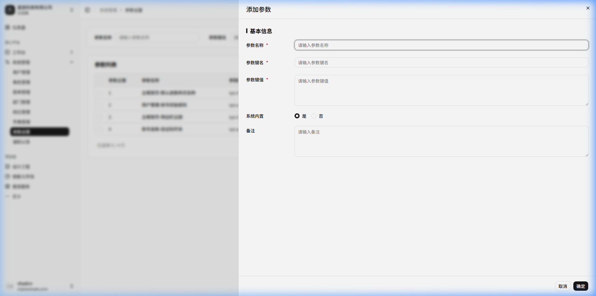

# 参数设置

## 功能描述
<!-- 描述该模块或页面的核心功能和业务目标 -->
提供对系统级运行参数、配置项的动态化管理。通过此模块，管理员无需修改代码或重启服务，即可在界面上直接调整如：默认初始密码、验证码开关、系统名称、皮肤样式等全局系统参数。

## 业务流程
<!-- 描述该模块内的具体业务流转过程，可包含流程图和流转说明 -->

流程说明：

1) 管理员登录进入“参数设置”页面，集中查看系统运行配置项列表；
2) 点击“新增”，输入参数名称、参数键名、参数键值、系统内置标识及备注；
3) 点击“修改”，针对非内置或可调控参数修改具体键值（如用户初始默认密码、验证码开关、皮肤样式配置等）；
4) 点击“删除”，系统校验参数属性，若属于“系统内置”参数则严格禁止删除，防止破坏核心系统功能；
5) 保存配置后，点击“刷新缓存”，参数立即生效并供各前端组件和后端服务动态获取。

## 功能设计

### 1. 参数列表页面

**1. 页面原型**
<!-- 插入该页面的原型图或UI设计图 -->

（来源参考：`http://localhost:5173/system/config`）

**2. 功能说明**
<!-- 详细描述页面上的各个功能按钮、操作逻辑及数据流转规则 -->
- 搜索：支持按参数名称、参数键名、是否系统内置、创建时间等进行过滤查询。
- 数据保护：系统内置（是）的参数记录，不允许通过界面直接删除，只能修改其键值。
- 缓存同步：提供“刷新缓存”按钮，确保参数修改后立即对所有分布式节点或前端生效。

**3. 页面控件**
<!-- 详细列出页面上的控件元素及其交互事件 -->
| 名称 | 类型 | 位置 | 事件 | 说明 |
| :--- | :--- | :--- | :--- | :--- |
| 参数名称搜索框 | Input | 顶部搜索区 | 输入(onInput) | 模糊匹配 |
| 参数键名搜索框 | Input | 顶部搜索区 | 输入(onInput) | 模糊匹配 |
| 系统内置下拉框 | Select | 顶部搜索区 | 选择(onChange) | 是/否 |
| 搜索/重置按钮 | Button | 顶部搜索区 | 点击(onClick) | 触发查询/清空 |
| 新增按钮 | Button | 表格操作区 | 点击(onClick) | 弹出新增表单 |
| 刷新缓存按钮 | Button | 表格操作区 | 点击(onClick) | 同步最新参数数据到缓存 |
| 修改/删除按钮 | Button | 表格行操作列 | 点击(onClick) | 对单条参数进行编辑或删除操作 |

**4. 页面字段**
<!-- 详细列出页面或表单中涉及的核心数据字段及其规则 -->
| 名称 | 数据类型 | 长度 | 允许操作 | 是否必输 | 录入方式 | 备注 |
| :--- | :--- | :--- | :--- | :--- | :--- | :--- |
| 参数主键 | Number | - | 查看 | 是 | 系统生成 | |
| 参数名称 | String | 100 | 查看 | 是 | 手工输入 | 如“主框架页-默认皮肤样式” |
| 参数键名 | String | 100 | 查看 | 是 | 手工输入 | 全局唯一变量名，如 `sys.index.skinName` |
| 参数键值 | String | 500 | 修改 | 是 | 手工输入 | 实际运行时读取的 Value |
| 系统内置 | Tag | - | 查看 | 是 | - | 是/否 |
| 备注 | String | 500 | 查看 | - | - | |

---

### 2. 新增/修改参数

**1. 页面原型**
<!-- 插入该页面的原型图或UI设计图 -->

**2. 页面字段**
<!-- 详细列出页面或表单中涉及的核心数据字段及其规则 -->
| 名称 | 数据类型 | 长度 | 允许操作 | 是否必输 | 录入方式 | 备注 |
| :--- | :--- | :--- | :--- | :--- | :--- | :--- |
| 参数名称 | String | 100 | 新增/修改 | 是 | 手工输入 | |
| 参数键名 | String | 100 | 新增/修改 | 是 | 手工输入 | 前后端约定的统一 Key |
| 参数键值 | String | 500 | 新增/修改 | 是 | 手工输入 | 支持多行文本或长字符串 |
| 系统内置 | String | 1 | 新增/修改 | 是 | 单选框 | 是/否，内置参数受系统保护 |
| 备注 | String | 500 | 新增/修改 | 否 | 多行文本 | |
