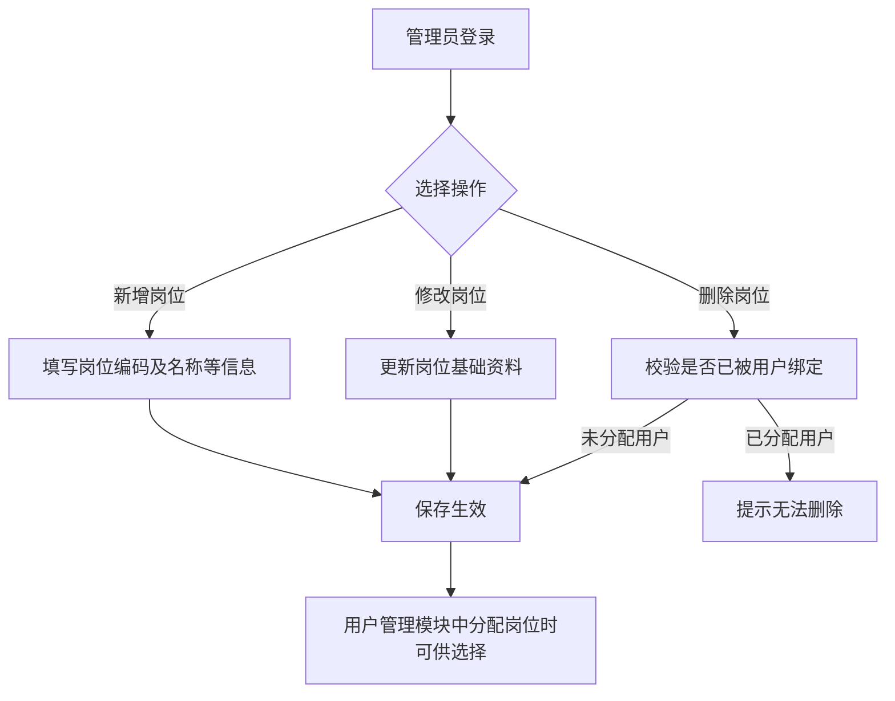
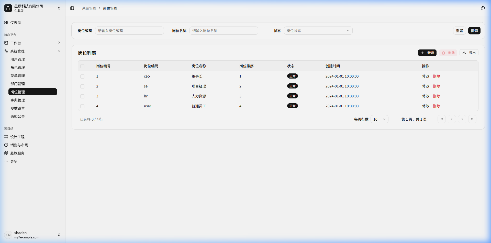
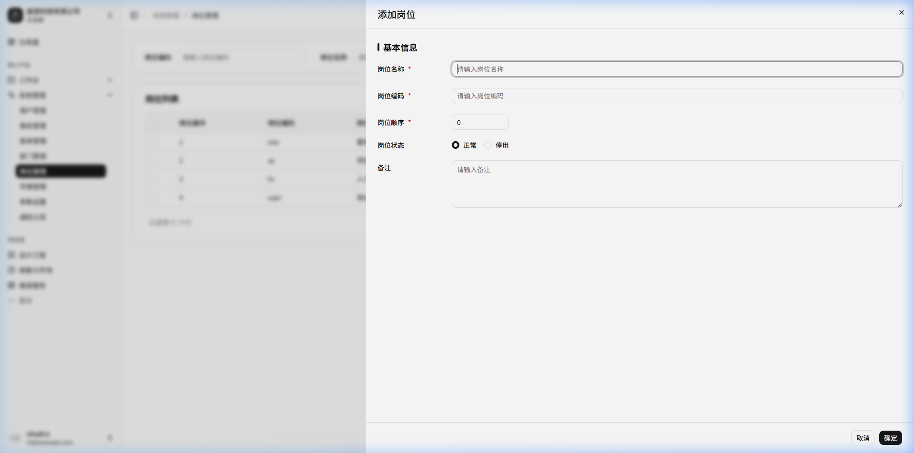

# 岗位管理

## 功能描述
<!-- 描述该模块或页面的核心功能和业务目标 -->
提供对企业或组织内部岗位信息的统一管理功能。支持岗位的增删改查及数据导出，岗位信息通常与用户资料进行绑定，为系统工作流审批、业务角色划分提供数据支撑。

## 业务流程
<!-- 描述该模块内的具体业务流转过程，可包含流程图和流转说明 -->

流程说明：

1) 管理员登录进入“岗位管理”页面，查看现有岗位编制与编码清单；
2) 点击“新增”，录入岗位编码、岗位名称、显示顺序及启用状态；
3) 点击“修改”，对已有岗位的名称、顺序或启停状态进行变更；
4) 点击“删除”，系统校验是否有在职用户被赋予该岗位，若已被用户占用则给出拦截提示，未分配时方可执行删除；
5) 岗位配置生效后，在用户管理的新增与编辑中均可多选关联对应岗位。

## 功能设计

### 岗位列表页面

**1. 页面原型**
<!-- 插入该页面的原型图或UI设计图 -->

（来源参考：`http://localhost:5173/system/post`）

**2. 功能说明**
<!-- 详细描述页面上的各个功能按钮、操作逻辑及数据流转规则 -->
- 搜索：支持按岗位编码、岗位名称、状态等条件进行过滤查询。
- 数据展示：以分页表格形式展示所有岗位记录。
- 行内操作：支持对单条岗位数据进行修改或删除。
- 批量操作：支持勾选多条岗位记录进行批量删除或数据导出。

**3. 页面控件**
<!-- 详细列出页面上的控件元素及其交互事件 -->
| 名称 | 类型 | 位置 | 事件 | 说明 |
| :--- | :--- | :--- | :--- | :--- |
| 岗位编码搜索框 | Input | 顶部搜索区 | 输入(onInput) | 支持模糊匹配 |
| 岗位名称搜索框 | Input | 顶部搜索区 | 输入(onInput) | 支持模糊匹配 |
| 状态选择框 | Select | 顶部搜索区 | 选择(onChange) | 下拉选单，如正常/停用 |
| 搜索按钮 | Button | 顶部搜索区 | 点击(onClick) | 触发查询接口刷新列表 |
| 重置按钮 | Button | 顶部搜索区 | 点击(onClick) | 清空搜索条件并刷新 |
| 新增按钮 | Button | 表格上方操作区 | 点击(onClick) | 弹出新增岗位的表单弹窗 |
| 批量删除按钮 | Button | 表格上方操作区 | 点击(onClick) | 判断勾选数据，确认后批量删除 |
| 导出按钮 | Button | 表格上方操作区 | 点击(onClick) | 触发当前数据列表的导出下载 |
| 修改按钮(单行) | Button | 表格行操作列 | 点击(onClick) | 弹出对应记录的编辑表单 |
| 删除按钮(单行) | Button | 表格行操作列 | 点击(onClick) | 若存在已绑定的用户则拦截，否则二次确认后删除 |

**4. 页面字段**
<!-- 详细列出页面或表单中涉及的核心数据字段及其规则 -->
| 名称 | 数据类型 | 长度 | 允许操作 | 是否必输 | 录入方式 | 备注 |
| :--- | :--- | :--- | :--- | :--- | :--- | :--- |
| 岗位编号 | Number | - | 查看 | 是 | 系统生成 | 表格主键 |
| 岗位编码 | String | 64 | 查看 | 是 | 手工输入 | 全局唯一，用于业务判断 |
| 岗位名称 | String | 50 | 查看 | 是 | 手工输入 | |
| 岗位排序 | Number | 4 | 查看 | 是 | 手工输入 | 数字越小越靠前 |
| 状态 | Tag | - | 查看 | - | - | 正常/停用 |
| 创建时间 | DateTime | - | 查看 | 是 | 系统生成 | |

---

### 新增岗位/修改岗位

**1. 页面原型**
<!-- 插入该页面的原型图或UI设计图 -->

（参考原型图：点击“新增”按钮弹出的模态框）

**2. 功能说明**
<!-- 详细描述页面上的各个功能按钮、操作逻辑及数据流转规则 -->
- 用于录入或更新具体的岗位基础资料信息。
- “岗位编码”建议按公司约定的规范填写（如 `ceo`, `hr`, `se` 等），它常用于硬编码的权限或审批节点判断。

**3. 页面控件**
<!-- 详细列出页面上的控件元素及其交互事件 -->
| 名称 | 类型 | 位置 | 事件 | 说明 |
| :--- | :--- | :--- | :--- | :--- |
| 岗位名称输入框 | Input | 基础信息区 | 输入(onInput) | 岗位的中文名称 |
| 岗位编码输入框 | Input | 基础信息区 | 输入(onInput) | 岗位的唯一标识字符 |
| 岗位顺序输入框 | InputNumber| 基础信息区 | 输入(onInput) | 控制展示顺序 |
| 岗位状态单选 | RadioGroup | 基础信息区 | 选择(onChange) | 正常或停用 |
| 备注输入框 | TextArea | 扩展信息区 | 输入(onInput) | 岗位职责等附加说明 |
| 取消按钮 | Button | 底部操作区 | 点击(onClick) | 关闭弹窗，不保存数据 |
| 确定按钮 | Button | 底部操作区 | 点击(onClick) | 校验必填项与格式后提交保存 |

**4. 页面字段**
<!-- 详细列出页面或表单中涉及的核心数据字段及其规则 -->
| 名称 | 数据类型 | 长度 | 允许操作 | 是否必输 | 录入方式 | 备注 |
| :--- | :--- | :--- | :--- | :--- | :--- | :--- |
| 岗位名称 | String | 50 | 新增/修改 | 是 | 手工输入 | |
| 岗位编码 | String | 64 | 新增/修改 | 是 | 手工输入 | 全局唯一 |
| 岗位顺序 | Number | 4 | 新增/修改 | 是 | 手工输入 | 默认从0开始 |
| 岗位状态 | String | 1 | 新增/修改 | 否 | 单选框 | 正常/停用，默认正常 |
| 备注 | String | 500 | 新增/修改 | 否 | 多行文本 | |
