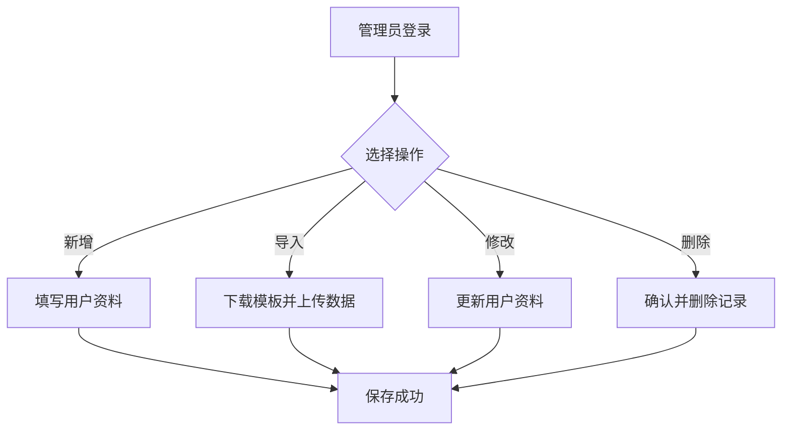
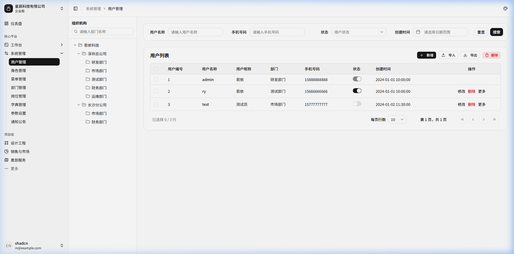
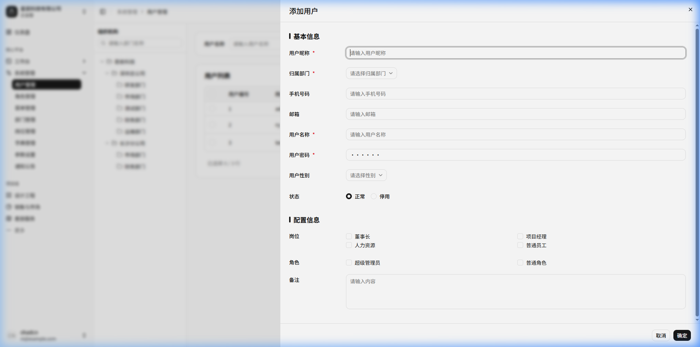
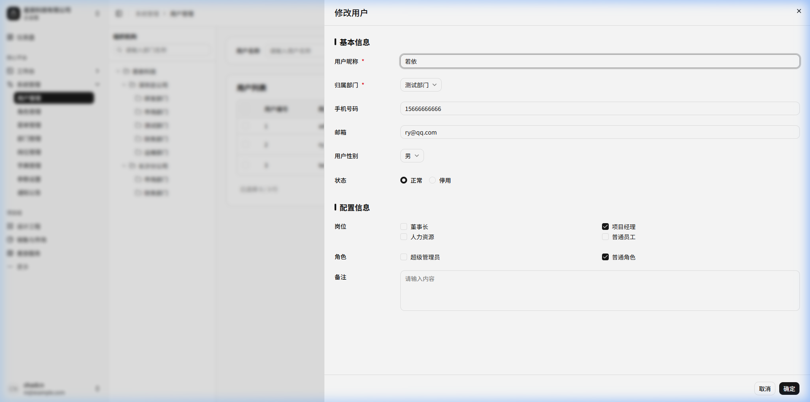
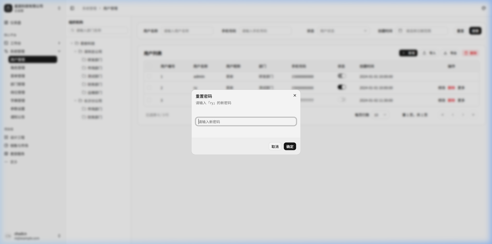
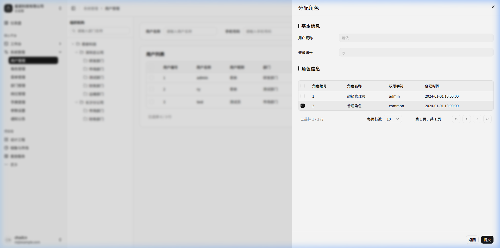

# 用户管理

## 功能描述
<!-- 描述该模块或页面的核心功能和业务目标 -->
提供对系统用户的全面管理功能，包括用户的增删改查、数据导入导出、密码重置、状态启停等，以满足平台权限和用户身份认证的基础需求。

## 业务流程
<!-- 描述该模块内的具体业务流转过程，可包含流程图和流转说明 -->

流程说明：

1) 管理员登录进入“用户管理”页面；
2) 根据管理需求选择对应操作，包括新增用户、批量导入、修改信息及删除用户等；
3) 执行新增或修改时，按表单规范录入或调整用户基本信息、所属部门、分配岗位及角色，经校验通过后保存生效；
4) 执行批量导入时，下载规范的 Excel 模板，上传填写好的数据并可选择覆盖更新；
5) 执行删除时，系统弹出二次确认提示，确认后物理/逻辑删除用户记录；
6) 对已有用户可进一步通过行内操作进行“重置密码”或在右侧抽屉中快捷“分配角色”。

## 功能设计

### 用户列表页面

**1. 页面原型**
<!-- 插入该页面的原型图或UI设计图 -->

（来源参考：`http://localhost:5173/system/user`）

**2. 功能说明**
<!-- 详细描述页面上的各个功能按钮、操作逻辑及数据流转规则 -->
- 搜索：支持按用户名称、手机号码、状态、创建时间等条件组合查询。
- 新增：打开新增用户弹窗，录入必要信息。
- 修改：选择一条记录后进行资料更新。
- 删除：单选或多选记录后，提示并执行物理/逻辑删除。
- 导入/导出：支持Excel格式的数据批量导入和当前列表数据的导出。
- 组织树过滤：点击左侧部门树节点，动态过滤并显示该部门下的用户数据。

**3. 页面控件**
<!-- 详细列出页面上的控件元素及其交互事件 -->
| 名称 | 类型 | 位置 | 事件 | 说明 |
| :--- | :--- | :--- | :--- | :--- |
| 左侧部门树 | Tree | 页面左侧 | 点击(onClick) | 选中部门时联动刷新右侧数据表格 |
| 用户名称搜索框 | Input | 顶部搜索区 | 输入(onInput) | 支持模糊匹配 |
| 手机号码搜索框 | Input | 顶部搜索区 | 输入(onInput) | 支持精确匹配或后几位匹配 |
| 状态选择框 | Select | 顶部搜索区 | 选择(onChange) | 下拉选单，如正常/停用 |
| 创建时间选择器 | DatePicker | 顶部搜索区 | 选择(onChange) | 日期范围选择 |
| 搜索按钮 | Button | 顶部搜索区 | 点击(onClick) | 触发查询接口刷新列表 |
| 重置按钮 | Button | 顶部搜索区 | 点击(onClick) | 清空搜索条件并刷新 |
| 新增按钮 | Button | 表格上方操作区 | 点击(onClick) | 弹出新增表单弹窗 |
| 修改按钮(批量) | Button | 表格上方操作区 | 点击(onClick) | 判断勾选单条数据，弹出编辑表单 |
| 删除按钮(批量) | Button | 表格上方操作区 | 点击(onClick) | 判断勾选数据，确认后删除 |
| 导入/导出按钮 | Button | 表格上方操作区 | 点击(onClick) | 触发文件上传下载 |
| 修改按钮(单行) | Button | 表格行操作列 | 点击(onClick) | 弹出对应记录的编辑表单 |
| 删除按钮(单行) | Button | 表格行操作列 | 点击(onClick) | 二次确认后删除当前记录 |
| 更多-重置密码 | Button | 表格行操作列下拉 | 点击(onClick) | 弹出重置当前用户密码模态框 |
| 更多-分配角色 | Button | 表格行操作列下拉 | 点击(onClick) | 弹出分配当前用户角色的右侧抽屉 |

**4. 页面字段**
<!-- 详细列出页面或表单中涉及的核心数据字段及其规则 -->
| 名称 | 数据类型 | 长度 | 允许操作 | 是否必输 | 录入方式 | 备注 |
| :--- | :--- | :--- | :--- | :--- | :--- | :--- |
| 用户编号 | String | 32 | 显示 | 否 | 自动生成 | 唯一主键 |
| 用户名称 | String | 50 | 显示 | 是 | 手动输入 | 用户名/登录账号 |
| 用户昵称 | String | 50 | 显示 | 否 | 手动输入 | 用于展示的姓名 |
| 部门 | String | 50 | 显示 | 否 | 树形选择 | 归属组织机构 |
| 手机号码 | String | 11 | 显示 | 否 | 手动输入 | 联系电话 |
| 状态 | Boolean | 1 | 修改 | 是 | 开关切换 | 正常/停用 |
| 创建时间 | DateTime | 0 | 显示 | 否 | 自动记录 | 账号创建的时间 |

### 新增用户弹窗

**1. 页面原型**
<!-- 插入该页面的原型图或UI设计图 -->

（参考原型图：点击“新增”按钮弹出的模态框）

**2. 功能说明**
<!-- 详细描述页面上的各个功能按钮、操作逻辑及数据流转规则 -->
- 用于录入新用户的完整资料。
- “用户名称”和“用户密码”为新增时的必填项。
- 支持直接分配用户所属的部门、岗位、角色。

**3. 页面控件**
<!-- 详细列出页面上的控件元素及其交互事件 -->
| 名称 | 类型 | 位置 | 事件 | 说明 |
| :--- | :--- | :--- | :--- | :--- |
| 取消按钮 | Button | 底部操作区 | 点击(onClick) | 关闭弹窗，不保存数据 |
| 确定按钮 | Button | 底部操作区 | 点击(onClick) | 校验必填项后提交保存 |

**4. 页面字段**
<!-- 详细列出页面或表单中涉及的核心数据字段及其规则 -->
| 名称 | 数据类型 | 长度 | 允许操作 | 是否必输 | 录入方式 | 备注 |
| :--- | :--- | :--- | :--- | :--- | :--- | :--- |
| 用户昵称 | String | 50 | 录入 | 是 | 文本框输入 | |
| 归属部门 | String | 50 | 选择 | 是 | 下拉选择树 | |
| 手机号码 | String | 11 | 录入 | 否 | 文本框输入 | |
| 邮箱 | String | 50 | 录入 | 否 | 文本框输入 | |
| 用户名称 | String | 50 | 录入 | 是 | 文本框输入 | 登录账号 |
| 用户密码 | String | 50 | 录入 | 是 | 密码框输入 | |
| 用户性别 | String | 10 | 选择 | 否 | 下拉选择框 | |
| 状态 | Boolean | 1 | 选择 | 否 | 单选复选框 | 正常/停用 |
| 岗位 | Array | - | 选择 | 否 | 多选复选框 | |
| 角色 | Array | - | 选择 | 否 | 多选复选框 | |
| 备注 | String | 500| 录入 | 否 | 多行文本框 | |

### 修改用户弹窗

**1. 页面原型**
<!-- 插入该页面的原型图或UI设计图 -->

（参考原型图：点击列表中“修改”按钮弹出的模态框）

**2. 功能说明**
<!-- 详细描述页面上的各个功能按钮、操作逻辑及数据流转规则 -->
- 用于修改已存在用户的资料信息。
- 相较于新增用户，修改时禁止修改“用户名称”，且不在此弹窗修改“用户密码”（密码修改通过单独的重置密码功能处理）。

**3. 页面控件**
<!-- 详细列出页面上的控件元素及其交互事件 -->
| 名称 | 类型 | 位置 | 事件 | 说明 |
| :--- | :--- | :--- | :--- | :--- |
| 取消按钮 | Button | 底部操作区 | 点击(onClick) | 关闭弹窗，不保存数据 |
| 确定按钮 | Button | 底部操作区 | 点击(onClick) | 校验必填项后提交更新 |

**4. 页面字段**
<!-- 详细列出页面或表单中涉及的核心数据字段及其规则 -->
| 名称 | 数据类型 | 长度 | 允许操作 | 是否必输 | 录入方式 | 备注 |
| :--- | :--- | :--- | :--- | :--- | :--- | :--- |
| 用户昵称 | String | 50 | 修改 | 是 | 文本框输入 | |
| 归属部门 | String | 50 | 修改 | 是 | 下拉选择树 | |
| 手机号码 | String | 11 | 修改 | 否 | 文本框输入 | |
| 邮箱 | String | 50 | 修改 | 否 | 文本框输入 | |
| 用户性别 | String | 10 | 修改 | 否 | 下拉选择框 | |
| 状态 | Boolean | 1 | 修改 | 否 | 单选复选框 | 正常/停用 |
| 岗位 | Array | - | 修改 | 否 | 多选复选框 | |
| 角色 | Array | - | 修改 | 否 | 多选复选框 | |
| 备注 | String | 500| 修改 | 否 | 多行文本框 | |

### 重置密码弹窗

**1. 页面原型**
<!-- 插入该页面的原型图或UI设计图 -->

（参考原型图：点击操作列更多中“重置密码”弹出的模态框）

**2. 功能说明**
<!-- 详细描述页面上的各个功能按钮、操作逻辑及数据流转规则 -->
- 强制为选定用户重新设置登录密码。

**3. 页面控件**
<!-- 详细列出页面上的控件元素及其交互事件 -->
| 名称 | 类型 | 位置 | 事件 | 说明 |
| :--- | :--- | :--- | :--- | :--- |
| 取消按钮 | Button | 底部操作区 | 点击(onClick) | 关闭弹窗 |
| 确定按钮 | Button | 底部操作区 | 点击(onClick) | 提交新密码 |

**4. 页面字段**
<!-- 详细列出页面或表单中涉及的核心数据字段及其规则 -->
| 名称 | 数据类型 | 长度 | 允许操作 | 是否必输 | 录入方式 | 备注 |
| :--- | :--- | :--- | :--- | :--- | :--- | :--- |
| 新密码 | String | 50 | 录入 | 是 | 密码框输入 | |

### 导入用户弹窗

**1. 页面原型**
<!-- 插入该页面的原型图或UI设计图 -->
（参考原型图：点击列表“导入”按钮弹出的模态框）

**2. 功能说明**
<!-- 详细描述页面上的各个功能按钮、操作逻辑及数据流转规则 -->
- 支持下载Excel模板，用户填写后上传实现批量导入。
- 支持勾选是否覆盖已存在的同名数据。

**3. 页面控件**
<!-- 详细列出页面上的控件元素及其交互事件 -->
| 名称 | 类型 | 位置 | 事件 | 说明 |
| :--- | :--- | :--- | :--- | :--- |
| 下载模板 | Link | 提示区 | 点击(onClick) | 下载标准的导入Excel模板 |
| 文件上传区 | Upload | 中间区域 | 点击/拖拽 | 选择需要导入的Excel文件 |
| 更新已有数据 | Checkbox| 底部 | 勾选(onChange) | 当数据存在时进行覆盖更新 |
| 取消按钮 | Button | 底部操作区 | 点击(onClick) | 关闭弹窗 |
| 确定按钮 | Button | 底部操作区 | 点击(onClick) | 提交并开始导入处理 |

### 分配角色抽屉

**1. 页面原型**
<!-- 插入该页面的原型图或UI设计图 -->

（参考原型图：点击操作列更多中“分配角色”弹出的右侧抽屉）

**2. 功能说明**
<!-- 详细描述页面上的各个功能按钮、操作逻辑及数据流转规则 -->
- 为选定的用户分配系统角色。
- 顶部显示当前用户的只读基本信息（昵称和账号）。
- 底部表格列出所有可用的角色，支持多选并分配。

**3. 页面控件**
<!-- 详细列出页面上的控件元素及其交互事件 -->
| 名称 | 类型 | 位置 | 事件 | 说明 |
| :--- | :--- | :--- | :--- | :--- |
| 返回按钮 | Button | 底部操作区 | 点击(onClick) | 关闭抽屉，不保存 |
| 提交按钮 | Button | 底部操作区 | 点击(onClick) | 提交勾选的角色信息并保存 |

**4. 页面字段**
<!-- 详细列出页面或表单中涉及的核心数据字段及其规则 -->
| 名称 | 数据类型 | 长度 | 允许操作 | 是否必输 | 录入方式 | 备注 |
| :--- | :--- | :--- | :--- | :--- | :--- | :--- |
| 用户昵称 | String | 50 | 显示 | 否 | 文本展示 | 顶部只读显示 |
| 登录账号 | String | 50 | 显示 | 否 | 文本展示 | 顶部只读显示 |
| 角色列表 | Array | - | 修改 | 是 | 表格多选框 | 列：角色编号、角色名称、权限字符、创建时间 |
