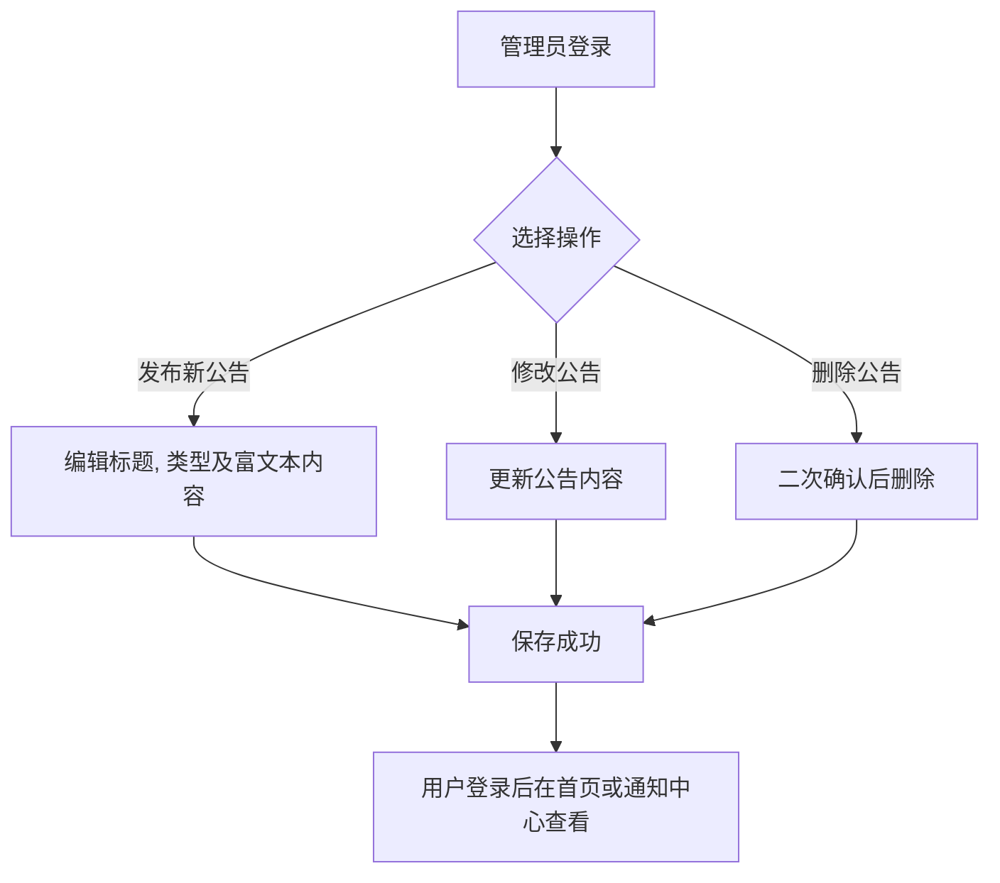
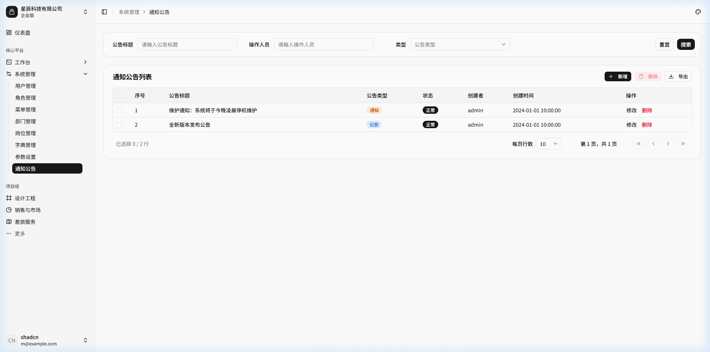
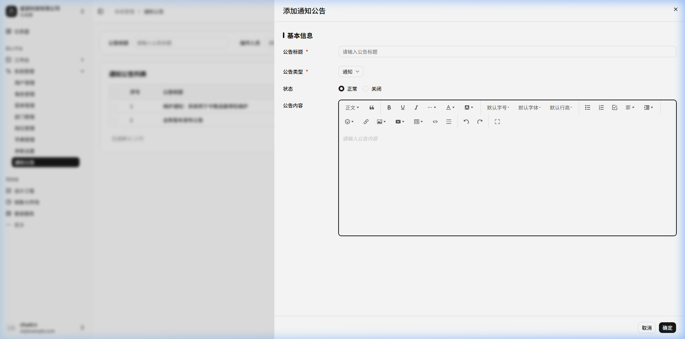
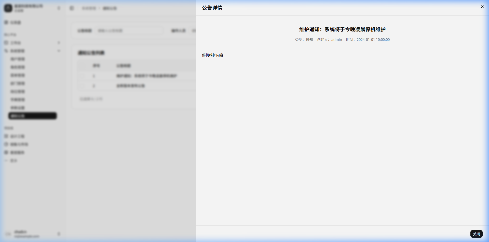

# 通知公告

## 功能描述
<!-- 描述该模块或页面的核心功能和业务目标 -->
提供向系统内部用户发布全站通知、公告信息的管理功能。支持公告信息的富文本编辑、状态控制，主要用于系统升级提示、业务通报、节假日放假通知等场景。

## 业务流程
<!-- 描述该模块内的具体业务流转过程，可包含流程图和流转说明 -->

流程说明：

1) 管理员登录进入“通知公告”页面，浏览系统发布的公告与通知历史；
2) 点击“新增”，填写公告标题、公告类型（通知/公告）、状态（正常/关闭），并通过富文本编辑器排版公告正文；
3) 点击“修改”，调整已有公告的发布内容、标题或紧急程度；
4) 点击“详情”或查看图标，打开弹窗查阅富文本排版效果，供管理员快速核对；
5) 对过期或失效公告可单选或批量勾选后执行删除。

## 功能设计

### 1. 通知公告列表页面

**1. 页面原型**
<!-- 插入该页面的原型图或UI设计图 -->

（来源参考：`http://localhost:5173/system/notice`）

**2. 功能说明**
<!-- 详细描述页面上的各个功能按钮、操作逻辑及数据流转规则 -->
- 搜索：支持按公告标题、操作人员、公告类型等进行过滤查询。
- 数据展示：展示所有的通知公告记录，默认按创建时间倒序排列。
- 权限隔离：普通用户只能查看已发布正常的公告，管理员可在此页面管理所有状态的公告。

**3. 页面控件**
<!-- 详细列出页面上的控件元素及其交互事件 -->
| 名称 | 类型 | 位置 | 事件 | 说明 |
| :--- | :--- | :--- | :--- | :--- |
| 公告标题搜索框 | Input | 顶部搜索区 | 输入(onInput) | 模糊匹配 |
| 操作人员搜索框 | Input | 顶部搜索区 | 输入(onInput) | 模糊匹配发布人 |
| 公告类型下拉框 | Select | 顶部搜索区 | 选择(onChange) | 通知/公告 |
| 搜索/重置按钮 | Button | 顶部搜索区 | 点击(onClick) | 触发查询/清空 |
| 新增/删除按钮 | Button | 表格操作区 | 点击(onClick) | 基础 CRUD 操作 |
| 公告标题链接 | Link | 表格行列 | 点击(onClick) | 点击列表中的公告标题，弹出该公告的详情页面查看完整内容 |
| 修改/删除按钮(单行) | Button | 表格行操作列 | 点击(onClick) | 对单条公告的操作 |

**4. 页面字段**
<!-- 详细列出页面或表单中涉及的核心数据字段及其规则 -->
| 名称 | 数据类型 | 长度 | 允许操作 | 是否必输 | 录入方式 | 备注 |
| :--- | :--- | :--- | :--- | :--- | :--- | :--- |
| 序号 | Number | - | 查看 | 是 | 系统生成 | |
| 公告标题 | String | 100 | 查看 | 是 | 手工输入 | |
| 公告类型 | Tag | - | 查看 | 是 | - | 通常区分为通知/公告 |
| 状态 | Tag | - | 查看 | - | - | 正常/关闭 |
| 创建者 | String | 50 | 查看 | - | - | |
| 创建时间 | DateTime | - | 查看 | 是 | 系统生成 | |

---

### 2. 新增/修改通知公告

**1. 页面原型**
<!-- 插入该页面的原型图或UI设计图 -->

**2. 页面字段**
<!-- 详细列出页面或表单中涉及的核心数据字段及其规则 -->
| 名称 | 数据类型 | 长度 | 允许操作 | 是否必输 | 录入方式 | 备注 |
| :--- | :--- | :--- | :--- | :--- | :--- | :--- |
| 公告标题 | String | 100 | 新增/修改 | 是 | 手工输入 | |
| 公告类型 | String | 1 | 新增/修改 | 是 | 单选/下拉 | 关联字典表 |
| 状态 | String | 1 | 新增/修改 | 否 | 单选框 | 正常/关闭，关闭后不再前台展示 |
| 内容 | RichText | - | 新增/修改 | 否 | 富文本编辑器 | 支持图文排版、超链接插入等 |

---

### 3. 公告详情页面

**1. 页面原型**
<!-- 插入该页面的原型图或UI设计图 -->

（参考原型图：点击列表中公告标题弹出的详情模态框）

**2. 功能说明**
<!-- 详细描述页面上的各个功能按钮、操作逻辑及数据流转规则 -->
- 用于以只读模式向用户展示完整的公告信息，包括富文本内容、发布人和时间。
- 界面不包含任何可编辑的输入框，仅供查阅。

**3. 页面控件**
<!-- 详细列出页面上的控件元素及其交互事件 -->
| 名称 | 类型 | 位置 | 事件 | 说明 |
| :--- | :--- | :--- | :--- | :--- |
| 关闭按钮 | Button | 底部操作区 | 点击(onClick) | 关闭详情弹窗 |

**4. 页面字段**
<!-- 详细列出页面或表单中涉及的核心数据字段及其规则 -->
| 名称 | 数据类型 | 长度 | 允许操作 | 是否必输 | 录入方式 | 备注 |
| :--- | :--- | :--- | :--- | :--- | :--- | :--- |
| 公告标题 | String | - | 查看 | - | - | 大字号展示 |
| 基础信息 | String | - | 查看 | - | - | 包含公告类型、创建者和创建时间 |
| 公告内容 | RichText | - | 查看 | - | - | 富文本渲染展示区 |
