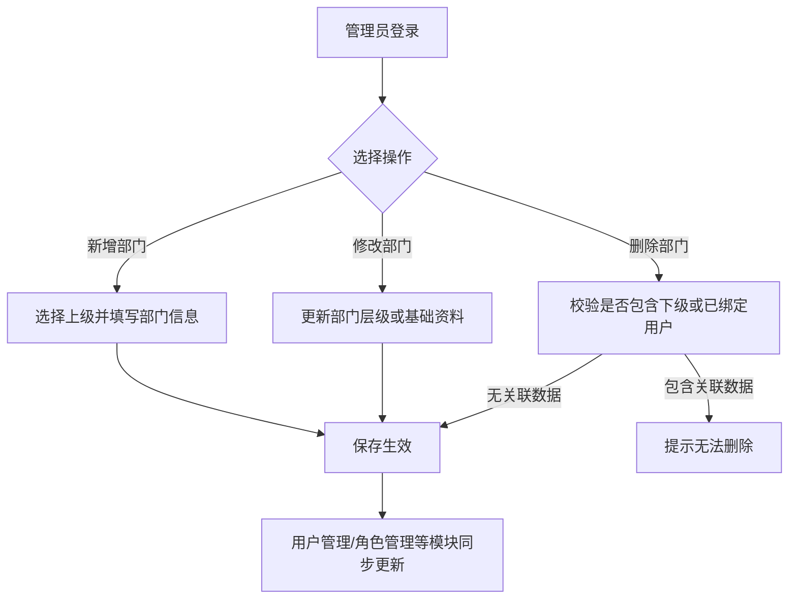
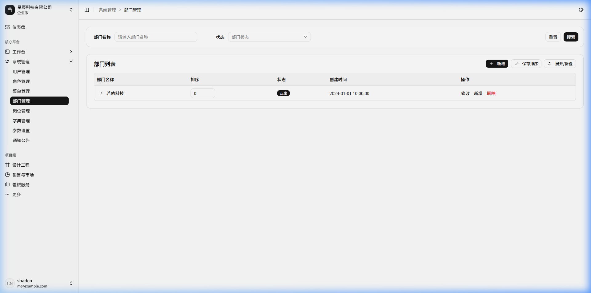
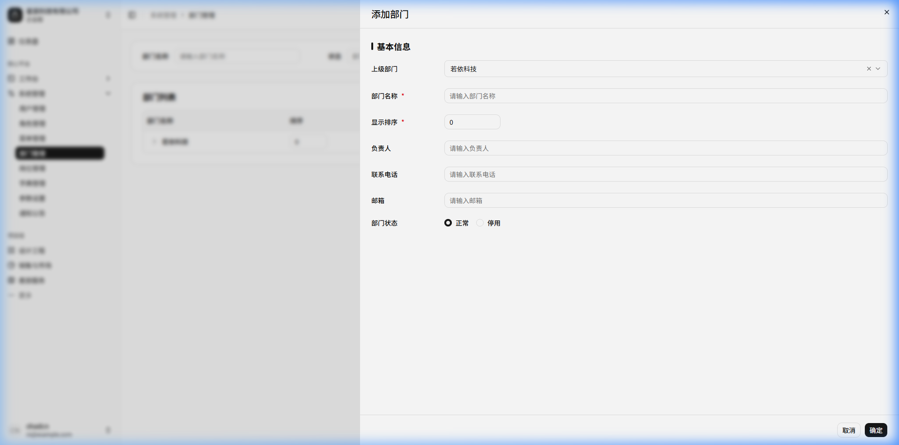

# 部门管理

## 功能描述
<!-- 描述该模块或页面的核心功能和业务目标 -->
提供对系统企业组织架构的统一管理功能。支持按树形结构管理各级部门/公司的增删改查，为用户分配部门归属及数据权限控制提供基础支撑。

## 业务流程
<!-- 描述该模块内的具体业务流转过程，可包含流程图和流转说明 -->

流程说明：

1) 管理员登录进入“部门管理”页面，查看企业或组织的树形架构层级；
2) 点击“新增部门”，选择归属上级部门，录入部门名称、显示顺序、负责人、联系电话、邮箱及启用状态；
3) 点击“修改部门”，对部门基础资料、负责人或组织架构从属关系进行更新调整；
4) 点击“删除部门”，系统执行关联性校验，若该部门下存在子部门或已关联在用系统用户，则拦截并提示无法删除；若无关联则予以删除；
5) 组织架构变动保存生效后，用户管理、数据权限过滤等相关业务模块同步联动更新。

## 功能设计

### 部门列表页面

**1. 页面原型**
<!-- 插入该页面的原型图或UI设计图 -->

（来源参考：`http://localhost:5173/system/dept`）

**2. 功能说明**
<!-- 详细描述页面上的各个功能按钮、操作逻辑及数据流转规则 -->
- 搜索：支持按部门名称、状态等条件进行过滤查询。
- 层级展示：采用树形表格(TreeTable)直观展示部门的父子组织关系，支持一键全部展开/折叠。
- 行内操作：支持在当前层级快速新增下级部门，或对当前部门进行修改、删除。

**3. 页面控件**
<!-- 详细列出页面上的控件元素及其交互事件 -->
| 名称 | 类型 | 位置 | 事件 | 说明 |
| :--- | :--- | :--- | :--- | :--- |
| 部门名称搜索框 | Input | 顶部搜索区 | 输入(onInput) | 支持模糊匹配 |
| 状态选择框 | Select | 顶部搜索区 | 选择(onChange) | 下拉选单，如正常/停用 |
| 搜索按钮 | Button | 顶部搜索区 | 点击(onClick) | 触发查询接口刷新列表 |
| 重置按钮 | Button | 顶部搜索区 | 点击(onClick) | 清空搜索条件并刷新 |
| 新增按钮 | Button | 表格上方操作区 | 点击(onClick) | 弹出新增顶级或同级部门的表单弹窗 |
| 展开/折叠按钮 | Button | 表格上方操作区 | 点击(onClick) | 控制整个树形表格的所有层级展开与收缩 |
| 修改按钮(单行) | Button | 表格行操作列 | 点击(onClick) | 弹出对应记录的编辑表单 |
| 新增按钮(单行) | Button | 表格行操作列 | 点击(onClick) | 弹出新增表单，且上级部门默认选中当前行 |
| 删除按钮(单行) | Button | 表格行操作列 | 点击(onClick) | 若存在下级部门或已绑定用户则拦截，否则二次确认后删除 |

**4. 页面字段**
<!-- 详细列出页面或表单中涉及的核心数据字段及其规则 -->
| 名称 | 数据类型 | 长度 | 允许操作 | 是否必输 | 录入方式 | 备注 |
| :--- | :--- | :--- | :--- | :--- | :--- | :--- |
| 部门名称 | String | 50 | 查看 | 是 | - | 树形节点展示 |
| 排序 | Number | 4 | 查看 | 是 | - | 数字越小越靠前 |
| 状态 | Tag | - | 查看 | - | - | 正常/停用 |
| 创建时间 | DateTime | - | 查看 | 是 | - | 系统生成 |

---

### 新增部门/修改部门

**1. 页面原型**
<!-- 插入该页面的原型图或UI设计图 -->

（参考原型图：点击“新增”按钮弹出的模态框）

**2. 功能说明**
<!-- 详细描述页面上的各个功能按钮、操作逻辑及数据流转规则 -->
- 用于录入或更新具体的部门基础资料信息。
- 支持通过重新选择“上级部门”来实现部门组织架构的调动（平移或降级），但禁止将部门挂载到自身的下级。

**3. 页面控件**
<!-- 详细列出页面上的控件元素及其交互事件 -->
| 名称 | 类型 | 位置 | 事件 | 说明 |
| :--- | :--- | :--- | :--- | :--- |
| 上级部门选择框 | TreeSelect| 基础信息区 | 选择(onChange) | 树形下拉选择，根节点可选择系统默认顶级节点 |
| 部门名称输入框 | Input | 基础信息区 | 输入(onInput) | 部门或公司名称 |
| 显示排序输入框 | InputNumber| 基础信息区 | 输入(onInput) | 控制同级部门的显示顺序 |
| 负责人输入框 | Input | 扩展信息区 | 输入(onInput) | 该部门的主要负责人姓名 |
| 联系电话输入框 | Input | 扩展信息区 | 输入(onInput) | 负责人的联系电话 |
| 邮箱输入框 | Input | 扩展信息区 | 输入(onInput) | 负责人的电子邮箱 |
| 部门状态单选 | RadioGroup | 基础信息区 | 选择(onChange) | 正常或停用 |
| 取消按钮 | Button | 底部操作区 | 点击(onClick) | 关闭弹窗，不保存数据 |
| 确定按钮 | Button | 底部操作区 | 点击(onClick) | 校验必填项与格式后提交保存 |

**4. 页面字段**
<!-- 详细列出页面或表单中涉及的核心数据字段及其规则 -->
| 名称 | 数据类型 | 长度 | 允许操作 | 是否必输 | 录入方式 | 备注 |
| :--- | :--- | :--- | :--- | :--- | :--- | :--- |
| 上级部门 | Number | - | 新增/修改 | 是 | 树形下拉 | |
| 部门名称 | String | 50 | 新增/修改 | 是 | 手工输入 | |
| 显示排序 | Number | 4 | 新增/修改 | 是 | 手工输入 | 默认从0开始 |
| 负责人 | String | 20 | 新增/修改 | 否 | 手工输入 | |
| 联系电话 | String | 11 | 新增/修改 | 否 | 手工输入 | 支持手机/固话格式校验 |
| 邮箱 | String | 50 | 新增/修改 | 否 | 手工输入 | 需符合邮箱格式校验 |
| 部门状态 | String | 1 | 新增/修改 | 否 | 单选框 | 正常/停用，默认正常 |
