### 功能设计

#### 功能清单

| 系统编码 | 系统名称 | 一级功能编码 | 一级功能点 | 二级功能编码 | 二级功能点 |
| :--- | :--- | :--- | :--- | :--- | :--- |
| SYS01 | 后台管理系统 | SYS_M | 系统管理 | SYS_M_01 | 参数设置 |
| SYS01 | 后台管理系统 | SYS_M | 系统管理 | SYS_M_02 | 字典管理 |
| SYS01 | 后台管理系统 | SYS_M | 系统管理 | SYS_M_03 | 岗位管理 |
| SYS01 | 后台管理系统 | SYS_M | 系统管理 | SYS_M_04 | 用户管理 |
| SYS01 | 后台管理系统 | SYS_M | 系统管理 | SYS_M_05 | 菜单管理 |
| SYS01 | 后台管理系统 | SYS_M | 系统管理 | SYS_M_06 | 角色管理 |
| SYS01 | 后台管理系统 | SYS_M | 系统管理 | SYS_M_07 | 通知公告 |
| SYS01 | 后台管理系统 | SYS_M | 系统管理 | SYS_M_08 | 部门管理 |

#### 系统管理

##### 参数设置

###### 功能描述

提供对系统级运行参数、配置项的动态化管理。通过此模块，管理员无需修改代码或重启服务，即可在界面上直接调整如：默认初始密码、验证码开关、系统名称、皮肤样式等全局系统参数。

###### 业务流程

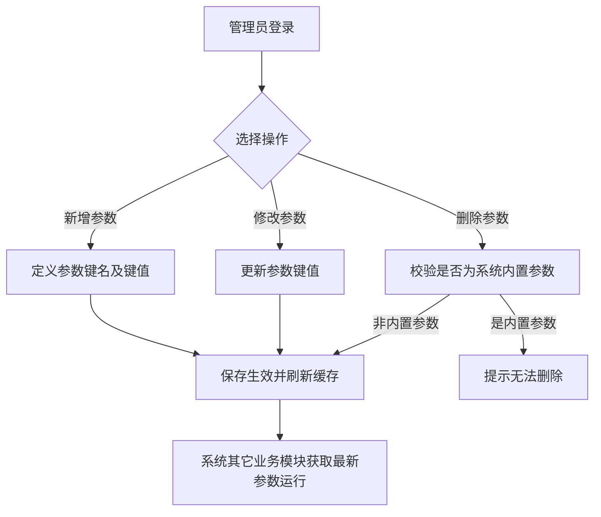
```mermaid
graph TD
    A[管理员登录] --> B{选择操作}
    B -- 新增参数 --> C[定义参数键名及键值]
    B -- 修改参数 --> D[更新参数键值]
    B -- 删除参数 --> E[校验是否为系统内置参数]
    C --> F[保存生效并刷新缓存]
    D --> F
    E -- 是内置参数 --> G[提示无法删除]
    E -- 非内置参数 --> F
    F --> H[系统其它业务模块获取最新参数运行]
```

###### 功能设计

###### 1. 参数列表页面

**1. 页面原型**

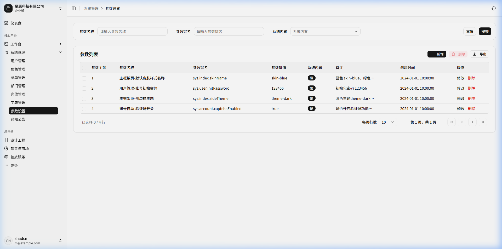
（来源参考：`http://localhost:5173/system/config`）

**2. 功能说明**

- 搜索：支持按参数名称、参数键名、是否系统内置、创建时间等进行过滤查询。
- 数据保护：系统内置（是）的参数记录，不允许通过界面直接删除，只能修改其键值。
- 缓存同步：提供“刷新缓存”按钮，确保参数修改后立即对所有分布式节点或前端生效。

**3. 页面控件**

| 名称 | 类型 | 位置 | 事件 | 说明 |
| :--- | :--- | :--- | :--- | :--- |
| 参数名称搜索框 | Input | 顶部搜索区 | 输入(onInput) | 模糊匹配 |
| 参数键名搜索框 | Input | 顶部搜索区 | 输入(onInput) | 模糊匹配 |
| 系统内置下拉框 | Select | 顶部搜索区 | 选择(onChange) | 是/否 |
| 搜索/重置按钮 | Button | 顶部搜索区 | 点击(onClick) | 触发查询/清空 |
| 新增按钮 | Button | 表格操作区 | 点击(onClick) | 弹出新增表单 |
| 刷新缓存按钮 | Button | 表格操作区 | 点击(onClick) | 同步最新参数数据到缓存 |
| 修改/删除按钮 | Button | 表格行操作列 | 点击(onClick) | 对单条参数进行编辑或删除操作 |

**4. 页面字段**

| 名称 | 数据类型 | 长度 | 允许操作 | 是否必输 | 录入方式 | 备注 |
| :--- | :--- | :--- | :--- | :--- | :--- | :--- |
| 参数主键 | Number | - | 查看 | 是 | 系统生成 | |
| 参数名称 | String | 100 | 查看 | 是 | 手工输入 | 如“主框架页-默认皮肤样式” |
| 参数键名 | String | 100 | 查看 | 是 | 手工输入 | 全局唯一变量名，如 `sys.index.skinName` |
| 参数键值 | String | 500 | 修改 | 是 | 手工输入 | 实际运行时读取的 Value |
| 系统内置 | Tag | - | 查看 | 是 | - | 是/否 |
| 备注 | String | 500 | 查看 | - | - | |

---

###### 2. 新增/修改参数

**1. 页面原型**

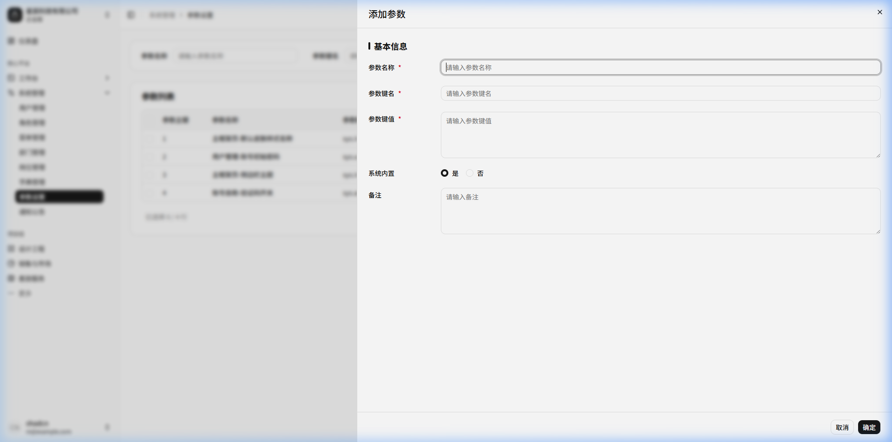

**2. 页面字段**

| 名称 | 数据类型 | 长度 | 允许操作 | 是否必输 | 录入方式 | 备注 |
| :--- | :--- | :--- | :--- | :--- | :--- | :--- |
| 参数名称 | String | 100 | 新增/修改 | 是 | 手工输入 | |
| 参数键名 | String | 100 | 新增/修改 | 是 | 手工输入 | 前后端约定的统一 Key |
| 参数键值 | String | 500 | 新增/修改 | 是 | 手工输入 | 支持多行文本或长字符串 |
| 系统内置 | String | 1 | 新增/修改 | 是 | 单选框 | 是/否，内置参数受系统保护 |
| 备注 | String | 500 | 新增/修改 | 否 | 多行文本 | |

##### 字典管理

###### 功能描述

提供系统中固定枚举数据（如下拉框选项、状态值、业务类型等）的集中管理。通过“字典类型”与“字典数据”两级结构维护，业务表只需保存字典键值，降低数据冗余，并支持前端组件动态读取渲染。

###### 业务流程

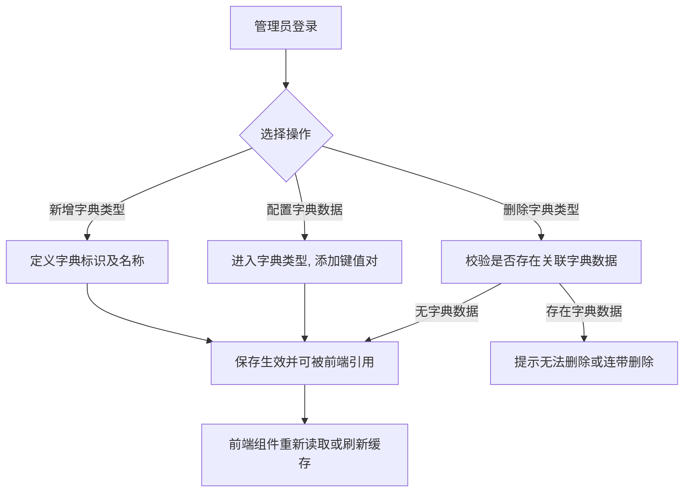
```mermaid
graph TD
    A[管理员登录] --> B{选择操作}
    B -- 新增字典类型 --> C[定义字典标识及名称]
    B -- 配置字典数据 --> D[进入字典类型, 添加键值对]
    B -- 删除字典类型 --> E[校验是否存在关联字典数据]
    C --> F[保存生效并可被前端引用]
    D --> F
    E -- 存在字典数据 --> G[提示无法删除或连带删除]
    E -- 无字典数据 --> F
    F --> H[前端组件重新读取或刷新缓存]
```

###### 功能设计

###### 1. 字典类型列表页面

**1. 页面原型**

（来源参考：`http://localhost:5173/system/dict`）

**2. 功能说明**

- 搜索：支持按字典名称、字典类型、状态、创建时间等进行组合查询。
- 缓存管理：提供“刷新缓存”按钮，修改字典后更新 Redis/本地 缓存。
- 数据维护：点击具体行进入或点击“列表”进入对应的字典数据维护页面。

**3. 页面控件**

| 名称 | 类型 | 位置 | 事件 | 说明 |
| :--- | :--- | :--- | :--- | :--- |
| 字典名称/类型搜索框 | Input | 顶部搜索区 | 输入(onInput) | 模糊匹配 |
| 状态选择框 | Select | 顶部搜索区 | 选择(onChange) | 正常/停用 |
| 搜索/重置按钮 | Button | 顶部搜索区 | 点击(onClick) | 触发查询/清空 |
| 新增/修改/删除按钮 | Button | 表格操作区 | 点击(onClick) | 基础 CRUD 操作 |
| 刷新缓存按钮 | Button | 表格上方操作区 | 点击(onClick) | 强制同步最新字典数据到缓存 |
| 修改/删除按钮(单行) | Button | 表格行操作列 | 点击(onClick) | 对单条字典类型的操作 |
| 字典类型链接 | Link | 表格行 | 点击(onClick) | 跳转至该类型的“字典数据”管理列表 |

**4. 页面字段**

| 名称 | 数据类型 | 长度 | 允许操作 | 是否必输 | 录入方式 | 备注 |
| :--- | :--- | :--- | :--- | :--- | :--- | :--- |
| 字典主键 | Number | - | 查看 | 是 | 系统生成 | |
| 字典名称 | String | 100 | 查看 | 是 | 手工输入 | |
| 字典类型 | String | 100 | 查看 | 是 | 手工输入 | 唯一标识符，如 `sys_user_sex` |
| 状态 | Tag | - | 查看 | - | - | 正常/停用 |

---

###### 2. 新增/修改字典类型

**1. 页面原型**

**2. 页面字段**

| 名称 | 数据类型 | 长度 | 允许操作 | 是否必输 | 录入方式 | 备注 |
| :--- | :--- | :--- | :--- | :--- | :--- | :--- |
| 字典名称 | String | 100 | 新增/修改 | 是 | 手工输入 | |
| 字典类型 | String | 100 | 新增/修改 | 是 | 手工输入 | 建议使用全英文字母及下划线 |
| 状态 | String | 1 | 新增/修改 | 否 | 单选框 | |
| 备注 | String | 500 | 新增/修改 | 否 | 多行文本 | |

---

###### 3. 字典数据列表页面

**1. 页面原型**

（参考原型图：点击字典类型后进入的明细页面）

**2. 功能说明**

- 显示某个“字典类型”下的所有可选项（键值对）。
- 支持修改默认选中项、排序和显示样式（如 Element/Shadcn 组件的不同颜色 Tag）。

**3. 页面控件**

| 名称 | 类型 | 位置 | 事件 | 说明 |
| :--- | :--- | :--- | :--- | :--- |
| 字典类型下拉框 | Select | 顶部搜索区 | 选择(onChange) | 可在列表页直接切换查看其他字典类型 |
| 数据标签/键值搜索 | Input | 顶部搜索区 | 输入(onInput) | 模糊或精确匹配 |
| 状态选择框 | Select | 顶部搜索区 | 选择(onChange) | 正常/停用 |
| 新增/修改/删除按钮 | Button | 表格操作区 | 点击(onClick) | 针对键值对的基础操作 |

**4. 页面字段**

| 名称 | 数据类型 | 长度 | 允许操作 | 是否必输 | 录入方式 | 备注 |
| :--- | :--- | :--- | :--- | :--- | :--- | :--- |
| 字典标签 | String | 100 | 查看 | 是 | - | 前端展示的中文名，如“男” |
| 字典键值 | String | 100 | 查看 | 是 | - | 存入数据库的实际值，如“0” |
| 字典排序 | Number | 4 | 查看 | 是 | - | |
| 状态 | Tag | - | 查看 | - | - | |

---

###### 4. 新增/修改字典数据

**1. 页面原型**

**2. 页面字段**

| 名称 | 数据类型 | 长度 | 允许操作 | 是否必输 | 录入方式 | 备注 |
| :--- | :--- | :--- | :--- | :--- | :--- | :--- |
| 字典类型 | String | 100 | 查看 | 是 | 系统带入 | 只读，对应所属类型 |
| 数据标签 | String | 100 | 新增/修改 | 是 | 手工输入 | |
| 数据键值 | String | 100 | 新增/修改 | 是 | 手工输入 | |
| 样式属性 | String | 100 | 新增/修改 | 否 | 手工输入 | 控制 Tag 的 class 或 css |
| 回显样式 | Select | 100 | 新增/修改 | 否 | 下拉选择 | 预设主题（primary/success/info等） |
| 显示排序 | Number | 4 | 新增/修改 | 是 | 手工输入 | |
| 状态 | String | 1 | 新增/修改 | 否 | 单选框 | 正常/停用 |
| 备注 | String | 500 | 新增/修改 | 否 | 多行文本 | |

##### 岗位管理

###### 功能描述

提供对企业或组织内部岗位信息的统一管理功能。支持岗位的增删改查及数据导出，岗位信息通常与用户资料进行绑定，为系统工作流审批、业务角色划分提供数据支撑。

###### 业务流程

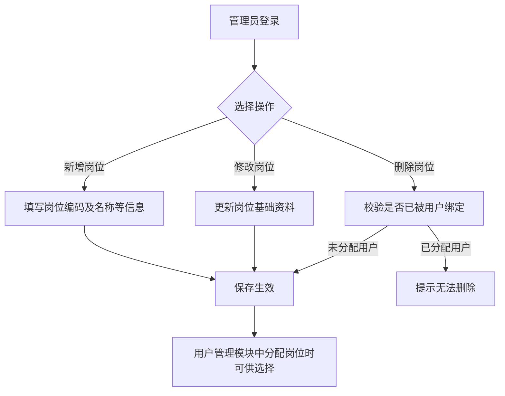
```mermaid
graph TD
    A[管理员登录] --> B{选择操作}
    B -- 新增岗位 --> C[填写岗位编码及名称等信息]
    B -- 修改岗位 --> D[更新岗位基础资料]
    B -- 删除岗位 --> E[校验是否已被用户绑定]
    C --> F[保存生效]
    D --> F
    E -- 已分配用户 --> G[提示无法删除]
    E -- 未分配用户 --> F
    F --> H[用户管理模块中分配岗位时可供选择]
```

###### 功能设计

###### 岗位列表页面

**1. 页面原型**

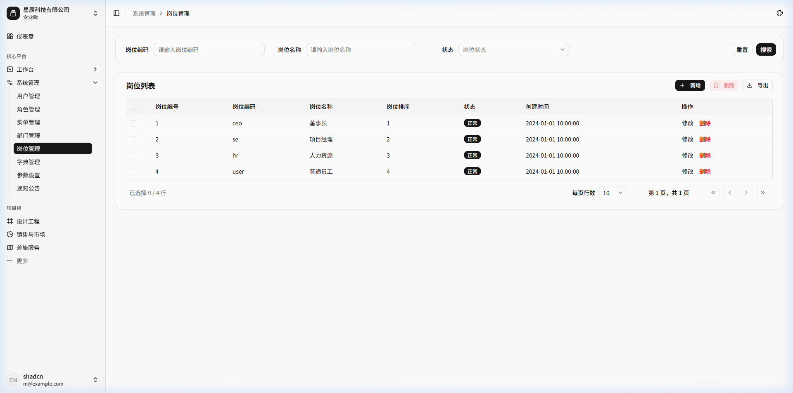
（来源参考：`http://localhost:5173/system/post`）

**2. 功能说明**

- 搜索：支持按岗位编码、岗位名称、状态等条件进行过滤查询。
- 数据展示：以分页表格形式展示所有岗位记录。
- 行内操作：支持对单条岗位数据进行修改或删除。
- 批量操作：支持勾选多条岗位记录进行批量删除或数据导出。

**3. 页面控件**

| 名称 | 类型 | 位置 | 事件 | 说明 |
| :--- | :--- | :--- | :--- | :--- |
| 岗位编码搜索框 | Input | 顶部搜索区 | 输入(onInput) | 支持模糊匹配 |
| 岗位名称搜索框 | Input | 顶部搜索区 | 输入(onInput) | 支持模糊匹配 |
| 状态选择框 | Select | 顶部搜索区 | 选择(onChange) | 下拉选单，如正常/停用 |
| 搜索按钮 | Button | 顶部搜索区 | 点击(onClick) | 触发查询接口刷新列表 |
| 重置按钮 | Button | 顶部搜索区 | 点击(onClick) | 清空搜索条件并刷新 |
| 新增按钮 | Button | 表格上方操作区 | 点击(onClick) | 弹出新增岗位的表单弹窗 |
| 批量删除按钮 | Button | 表格上方操作区 | 点击(onClick) | 判断勾选数据，确认后批量删除 |
| 导出按钮 | Button | 表格上方操作区 | 点击(onClick) | 触发当前数据列表的导出下载 |
| 修改按钮(单行) | Button | 表格行操作列 | 点击(onClick) | 弹出对应记录的编辑表单 |
| 删除按钮(单行) | Button | 表格行操作列 | 点击(onClick) | 若存在已绑定的用户则拦截，否则二次确认后删除 |

**4. 页面字段**

| 名称 | 数据类型 | 长度 | 允许操作 | 是否必输 | 录入方式 | 备注 |
| :--- | :--- | :--- | :--- | :--- | :--- | :--- |
| 岗位编号 | Number | - | 查看 | 是 | 系统生成 | 表格主键 |
| 岗位编码 | String | 64 | 查看 | 是 | 手工输入 | 全局唯一，用于业务判断 |
| 岗位名称 | String | 50 | 查看 | 是 | 手工输入 | |
| 岗位排序 | Number | 4 | 查看 | 是 | 手工输入 | 数字越小越靠前 |
| 状态 | Tag | - | 查看 | - | - | 正常/停用 |
| 创建时间 | DateTime | - | 查看 | 是 | 系统生成 | |

---

###### 新增岗位/修改岗位

**1. 页面原型**

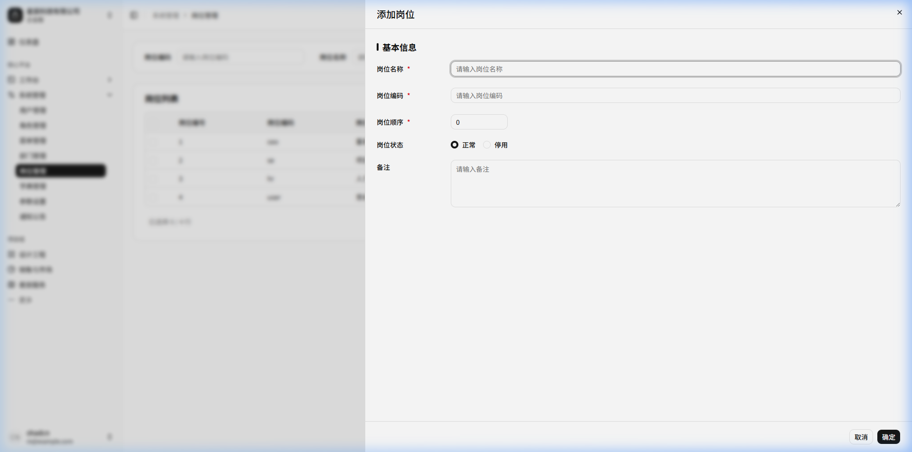
（参考原型图：点击“新增”按钮弹出的模态框）

**2. 功能说明**

- 用于录入或更新具体的岗位基础资料信息。
- “岗位编码”建议按公司约定的规范填写（如 `ceo`, `hr`, `se` 等），它常用于硬编码的权限或审批节点判断。

**3. 页面控件**

| 名称 | 类型 | 位置 | 事件 | 说明 |
| :--- | :--- | :--- | :--- | :--- |
| 岗位名称输入框 | Input | 基础信息区 | 输入(onInput) | 岗位的中文名称 |
| 岗位编码输入框 | Input | 基础信息区 | 输入(onInput) | 岗位的唯一标识字符 |
| 岗位顺序输入框 | InputNumber| 基础信息区 | 输入(onInput) | 控制展示顺序 |
| 岗位状态单选 | RadioGroup | 基础信息区 | 选择(onChange) | 正常或停用 |
| 备注输入框 | TextArea | 扩展信息区 | 输入(onInput) | 岗位职责等附加说明 |
| 取消按钮 | Button | 底部操作区 | 点击(onClick) | 关闭弹窗，不保存数据 |
| 确定按钮 | Button | 底部操作区 | 点击(onClick) | 校验必填项与格式后提交保存 |

**4. 页面字段**

| 名称 | 数据类型 | 长度 | 允许操作 | 是否必输 | 录入方式 | 备注 |
| :--- | :--- | :--- | :--- | :--- | :--- | :--- |
| 岗位名称 | String | 50 | 新增/修改 | 是 | 手工输入 | |
| 岗位编码 | String | 64 | 新增/修改 | 是 | 手工输入 | 全局唯一 |
| 岗位顺序 | Number | 4 | 新增/修改 | 是 | 手工输入 | 默认从0开始 |
| 岗位状态 | String | 1 | 新增/修改 | 否 | 单选框 | 正常/停用，默认正常 |
| 备注 | String | 500 | 新增/修改 | 否 | 多行文本 | |

##### 用户管理

###### 功能描述

提供对系统用户的全面管理功能，包括用户的增删改查、数据导入导出、密码重置、状态启停等，以满足平台权限和用户身份认证的基础需求。

###### 业务流程

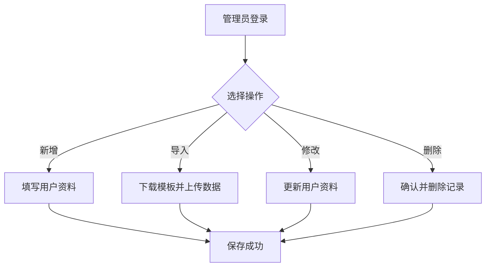
```mermaid
graph TD
    A[管理员登录] --> B{选择操作}
    B -- 新增 --> C[填写用户资料]
    B -- 导入 --> D[下载模板并上传数据]
    B -- 修改 --> E[更新用户资料]
    B -- 删除 --> F[确认并删除记录]
    C --> G[保存成功]
    D --> G
    E --> G
    F --> G
```

###### 功能设计

###### 用户列表页面

**1. 页面原型**

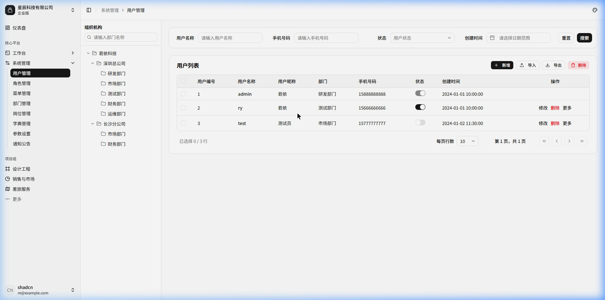
（来源参考：`http://localhost:5173/system/user`）

**2. 功能说明**

- 搜索：支持按用户名称、手机号码、状态、创建时间等条件组合查询。
- 新增：打开新增用户弹窗，录入必要信息。
- 修改：选择一条记录后进行资料更新。
- 删除：单选或多选记录后，提示并执行物理/逻辑删除。
- 导入/导出：支持Excel格式的数据批量导入和当前列表数据的导出。
- 组织树过滤：点击左侧部门树节点，动态过滤并显示该部门下的用户数据。

**3. 页面控件**

| 名称 | 类型 | 位置 | 事件 | 说明 |
| :--- | :--- | :--- | :--- | :--- |
| 左侧部门树 | Tree | 页面左侧 | 点击(onClick) | 选中部门时联动刷新右侧数据表格 |
| 用户名称搜索框 | Input | 顶部搜索区 | 输入(onInput) | 支持模糊匹配 |
| 手机号码搜索框 | Input | 顶部搜索区 | 输入(onInput) | 支持精确匹配或后几位匹配 |
| 状态选择框 | Select | 顶部搜索区 | 选择(onChange) | 下拉选单，如正常/停用 |
| 创建时间选择器 | DatePicker | 顶部搜索区 | 选择(onChange) | 日期范围选择 |
| 搜索按钮 | Button | 顶部搜索区 | 点击(onClick) | 触发查询接口刷新列表 |
| 重置按钮 | Button | 顶部搜索区 | 点击(onClick) | 清空搜索条件并刷新 |
| 新增按钮 | Button | 表格上方操作区 | 点击(onClick) | 弹出新增表单弹窗 |
| 修改按钮(批量) | Button | 表格上方操作区 | 点击(onClick) | 判断勾选单条数据，弹出编辑表单 |
| 删除按钮(批量) | Button | 表格上方操作区 | 点击(onClick) | 判断勾选数据，确认后删除 |
| 导入/导出按钮 | Button | 表格上方操作区 | 点击(onClick) | 触发文件上传下载 |
| 修改按钮(单行) | Button | 表格行操作列 | 点击(onClick) | 弹出对应记录的编辑表单 |
| 删除按钮(单行) | Button | 表格行操作列 | 点击(onClick) | 二次确认后删除当前记录 |
| 更多-重置密码 | Button | 表格行操作列下拉 | 点击(onClick) | 弹出重置当前用户密码模态框 |
| 更多-分配角色 | Button | 表格行操作列下拉 | 点击(onClick) | 弹出分配当前用户角色的右侧抽屉 |

**4. 页面字段**

| 名称 | 数据类型 | 长度 | 允许操作 | 是否必输 | 录入方式 | 备注 |
| :--- | :--- | :--- | :--- | :--- | :--- | :--- |
| 用户编号 | String | 32 | 显示 | 否 | 自动生成 | 唯一主键 |
| 用户名称 | String | 50 | 显示 | 是 | 手动输入 | 用户名/登录账号 |
| 用户昵称 | String | 50 | 显示 | 否 | 手动输入 | 用于展示的姓名 |
| 部门 | String | 50 | 显示 | 否 | 树形选择 | 归属组织机构 |
| 手机号码 | String | 11 | 显示 | 否 | 手动输入 | 联系电话 |
| 状态 | Boolean | 1 | 修改 | 是 | 开关切换 | 正常/停用 |
| 创建时间 | DateTime | 0 | 显示 | 否 | 自动记录 | 账号创建的时间 |

###### 新增用户弹窗

**1. 页面原型**

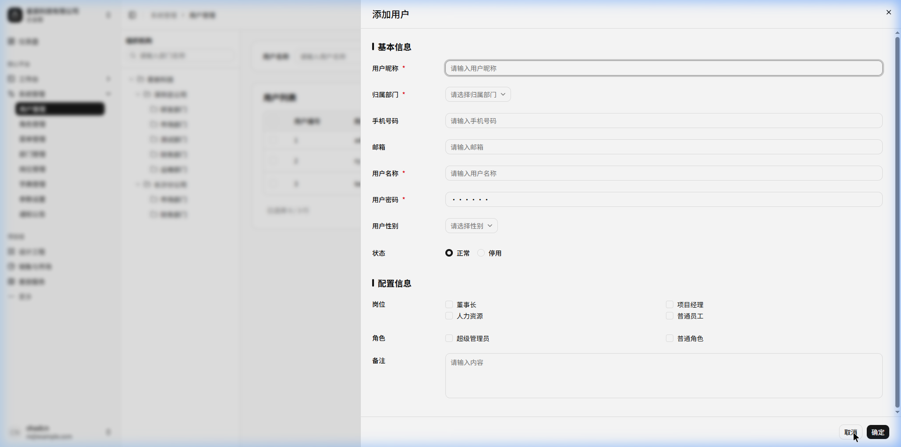
（参考原型图：点击“新增”按钮弹出的模态框）

**2. 功能说明**

- 用于录入新用户的完整资料。
- “用户名称”和“用户密码”为新增时的必填项。
- 支持直接分配用户所属的部门、岗位、角色。

**3. 页面控件**

| 名称 | 类型 | 位置 | 事件 | 说明 |
| :--- | :--- | :--- | :--- | :--- |
| 取消按钮 | Button | 底部操作区 | 点击(onClick) | 关闭弹窗，不保存数据 |
| 确定按钮 | Button | 底部操作区 | 点击(onClick) | 校验必填项后提交保存 |

**4. 页面字段**

| 名称 | 数据类型 | 长度 | 允许操作 | 是否必输 | 录入方式 | 备注 |
| :--- | :--- | :--- | :--- | :--- | :--- | :--- |
| 用户昵称 | String | 50 | 录入 | 是 | 文本框输入 | |
| 归属部门 | String | 50 | 选择 | 是 | 下拉选择树 | |
| 手机号码 | String | 11 | 录入 | 否 | 文本框输入 | |
| 邮箱 | String | 50 | 录入 | 否 | 文本框输入 | |
| 用户名称 | String | 50 | 录入 | 是 | 文本框输入 | 登录账号 |
| 用户密码 | String | 50 | 录入 | 是 | 密码框输入 | |
| 用户性别 | String | 10 | 选择 | 否 | 下拉选择框 | |
| 状态 | Boolean | 1 | 选择 | 否 | 单选复选框 | 正常/停用 |
| 岗位 | Array | - | 选择 | 否 | 多选复选框 | |
| 角色 | Array | - | 选择 | 否 | 多选复选框 | |
| 备注 | String | 500| 录入 | 否 | 多行文本框 | |

###### 修改用户弹窗

**1. 页面原型**

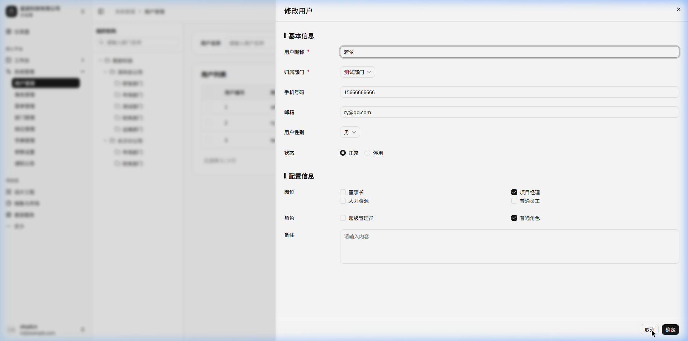
（参考原型图：点击列表中“修改”按钮弹出的模态框）

**2. 功能说明**

- 用于修改已存在用户的资料信息。
- 相较于新增用户，修改时禁止修改“用户名称”，且不在此弹窗修改“用户密码”（密码修改通过单独的重置密码功能处理）。

**3. 页面控件**

| 名称 | 类型 | 位置 | 事件 | 说明 |
| :--- | :--- | :--- | :--- | :--- |
| 取消按钮 | Button | 底部操作区 | 点击(onClick) | 关闭弹窗，不保存数据 |
| 确定按钮 | Button | 底部操作区 | 点击(onClick) | 校验必填项后提交更新 |

**4. 页面字段**

| 名称 | 数据类型 | 长度 | 允许操作 | 是否必输 | 录入方式 | 备注 |
| :--- | :--- | :--- | :--- | :--- | :--- | :--- |
| 用户昵称 | String | 50 | 修改 | 是 | 文本框输入 | |
| 归属部门 | String | 50 | 修改 | 是 | 下拉选择树 | |
| 手机号码 | String | 11 | 修改 | 否 | 文本框输入 | |
| 邮箱 | String | 50 | 修改 | 否 | 文本框输入 | |
| 用户性别 | String | 10 | 修改 | 否 | 下拉选择框 | |
| 状态 | Boolean | 1 | 修改 | 否 | 单选复选框 | 正常/停用 |
| 岗位 | Array | - | 修改 | 否 | 多选复选框 | |
| 角色 | Array | - | 修改 | 否 | 多选复选框 | |
| 备注 | String | 500| 修改 | 否 | 多行文本框 | |

###### 重置密码弹窗

**1. 页面原型**

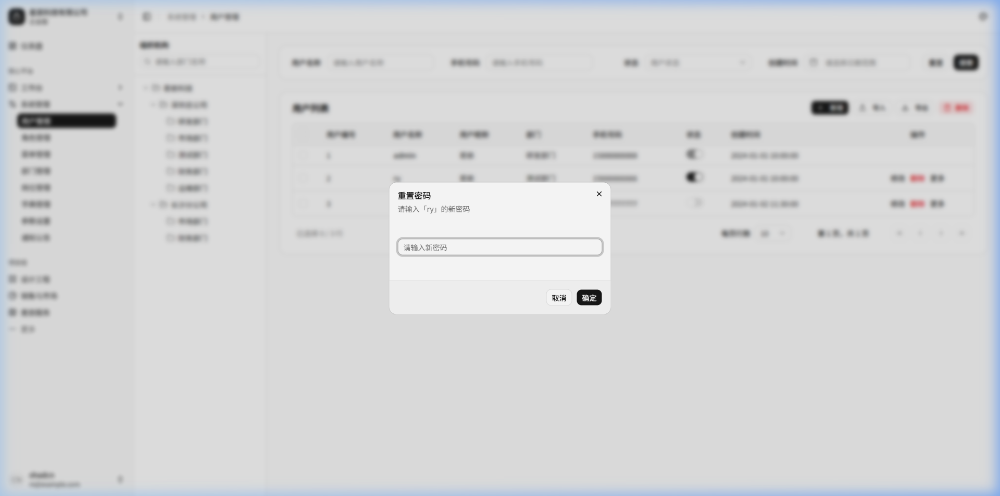
（参考原型图：点击操作列更多中“重置密码”弹出的模态框）

**2. 功能说明**

- 强制为选定用户重新设置登录密码。

**3. 页面控件**

| 名称 | 类型 | 位置 | 事件 | 说明 |
| :--- | :--- | :--- | :--- | :--- |
| 取消按钮 | Button | 底部操作区 | 点击(onClick) | 关闭弹窗 |
| 确定按钮 | Button | 底部操作区 | 点击(onClick) | 提交新密码 |

**4. 页面字段**

| 名称 | 数据类型 | 长度 | 允许操作 | 是否必输 | 录入方式 | 备注 |
| :--- | :--- | :--- | :--- | :--- | :--- | :--- |
| 新密码 | String | 50 | 录入 | 是 | 密码框输入 | |

###### 导入用户弹窗

**1. 页面原型**

（参考原型图：点击列表“导入”按钮弹出的模态框）

**2. 功能说明**

- 支持下载Excel模板，用户填写后上传实现批量导入。
- 支持勾选是否覆盖已存在的同名数据。

**3. 页面控件**

| 名称 | 类型 | 位置 | 事件 | 说明 |
| :--- | :--- | :--- | :--- | :--- |
| 下载模板 | Link | 提示区 | 点击(onClick) | 下载标准的导入Excel模板 |
| 文件上传区 | Upload | 中间区域 | 点击/拖拽 | 选择需要导入的Excel文件 |
| 更新已有数据 | Checkbox| 底部 | 勾选(onChange) | 当数据存在时进行覆盖更新 |
| 取消按钮 | Button | 底部操作区 | 点击(onClick) | 关闭弹窗 |
| 确定按钮 | Button | 底部操作区 | 点击(onClick) | 提交并开始导入处理 |

###### 分配角色抽屉

**1. 页面原型**

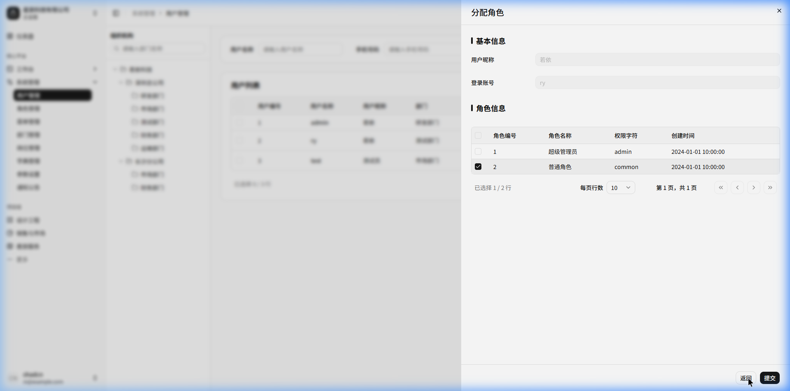
（参考原型图：点击操作列更多中“分配角色”弹出的右侧抽屉）

**2. 功能说明**

- 为选定的用户分配系统角色。
- 顶部显示当前用户的只读基本信息（昵称和账号）。
- 底部表格列出所有可用的角色，支持多选并分配。

**3. 页面控件**

| 名称 | 类型 | 位置 | 事件 | 说明 |
| :--- | :--- | :--- | :--- | :--- |
| 返回按钮 | Button | 底部操作区 | 点击(onClick) | 关闭抽屉，不保存 |
| 提交按钮 | Button | 底部操作区 | 点击(onClick) | 提交勾选的角色信息并保存 |

**4. 页面字段**

| 名称 | 数据类型 | 长度 | 允许操作 | 是否必输 | 录入方式 | 备注 |
| :--- | :--- | :--- | :--- | :--- | :--- | :--- |
| 用户昵称 | String | 50 | 显示 | 否 | 文本展示 | 顶部只读显示 |
| 登录账号 | String | 50 | 显示 | 否 | 文本展示 | 顶部只读显示 |
| 角色列表 | Array | - | 修改 | 是 | 表格多选框 | 列：角色编号、角色名称、权限字符、创建时间 |

##### 菜单管理

###### 功能描述

提供对系统左侧导航菜单、页面按钮权限标识的统一配置管理。支持树形层级结构的无限极菜单分类，能够灵活定义页面组件路径、路由地址及控制菜单的显示与隐藏状态。

###### 业务流程

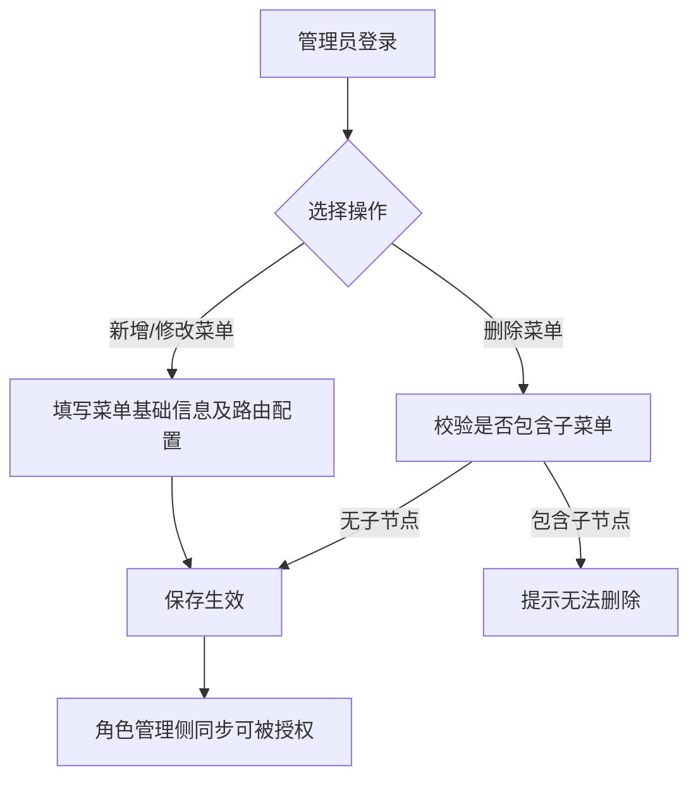
```mermaid
graph TD
    A[管理员登录] --> B{选择操作}
    B -- 新增/修改菜单 --> C[填写菜单基础信息及路由配置]
    B -- 删除菜单 --> D[校验是否包含子菜单]
    C --> E[保存生效]
    D -- 包含子节点 --> F[提示无法删除]
    D -- 无子节点 --> E
    E --> G[角色管理侧同步可被授权]
```

###### 功能设计

###### 菜单列表页面

**1. 页面原型**

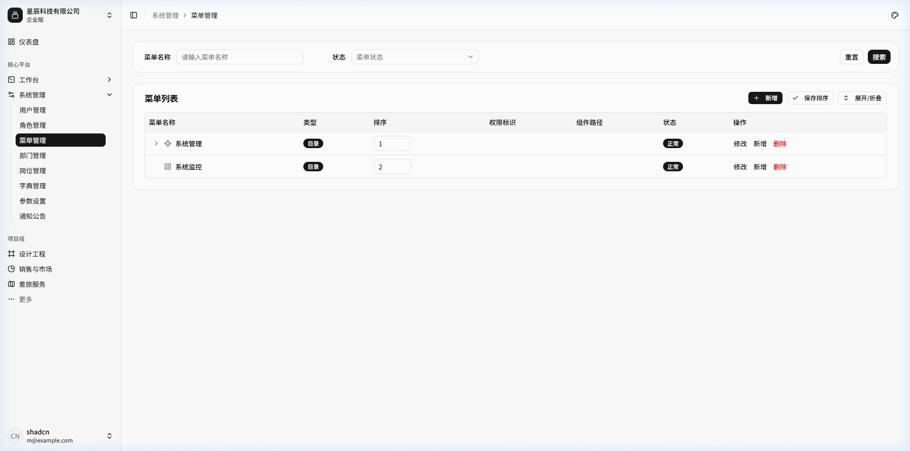
（来源参考：`http://localhost:5173/system/menu`）

**2. 功能说明**

- 搜索：支持按菜单名称、状态等条件进行过滤查询。
- 层级展示：采用树形表格(TreeTable)展示菜单的父子层级关系，支持一键全部展开/折叠。
- 行内操作：在表格对应行可直接进行修改、新增子菜单或删除操作。
- 排序功能：支持行内直接输入数字调整排序，并提供顶部“保存排序”按钮进行统一保存生效。

**3. 页面控件**

| 名称 | 类型 | 位置 | 事件 | 说明 |
| :--- | :--- | :--- | :--- | :--- |
| 菜单名称搜索框 | Input | 顶部搜索区 | 输入(onInput) | 支持模糊匹配 |
| 状态选择框 | Select | 顶部搜索区 | 选择(onChange) | 下拉选单，如正常/停用 |
| 搜索按钮 | Button | 顶部搜索区 | 点击(onClick) | 触发查询接口刷新列表 |
| 重置按钮 | Button | 顶部搜索区 | 点击(onClick) | 清空搜索条件并刷新 |
| 新增按钮 | Button | 表格上方操作区 | 点击(onClick) | 弹出新增一级菜单表单弹窗 |
| 保存排序按钮 | Button | 表格上方操作区 | 点击(onClick) | 批量提交表格内修改过的排序值 |
| 展开/折叠按钮 | Button | 表格上方操作区 | 点击(onClick) | 控制整个树形表格的所有层级展开与收缩 |
| 修改按钮(单行) | Button | 表格行操作列 | 点击(onClick) | 弹出对应记录的编辑表单 |
| 新增按钮(单行) | Button | 表格行操作列 | 点击(onClick) | 弹出新增表单，且上级菜单默认选中当前行 |
| 删除按钮(单行) | Button | 表格行操作列 | 点击(onClick) | 若存在子节点则拦截，否则二次确认后删除当前记录 |

**4. 页面字段**

| 名称 | 数据类型 | 长度 | 允许操作 | 是否必输 | 录入方式 | 备注 |
| :--- | :--- | :--- | :--- | :--- | :--- | :--- |
| 菜单名称 | String | 50 | 查看 | 是 | - | 树形节点展示 |
| 类型 | Tag | - | 查看 | - | - | 区分目录/菜单/按钮 |
| 排序 | Number | 4 | 修改 | 是 | 行内输入 | 表格支持直接编辑 |
| 权限标识 | String | 100 | 查看 | 否 | - | 前端组件鉴权字符串 |
| 组件路径 | String | 255 | 查看 | 否 | - | 对应前端文件相对路径 |
| 状态 | Tag | - | 查看 | - | - | 正常/停用 |

---

###### 新增菜单/修改菜单

**1. 页面原型**

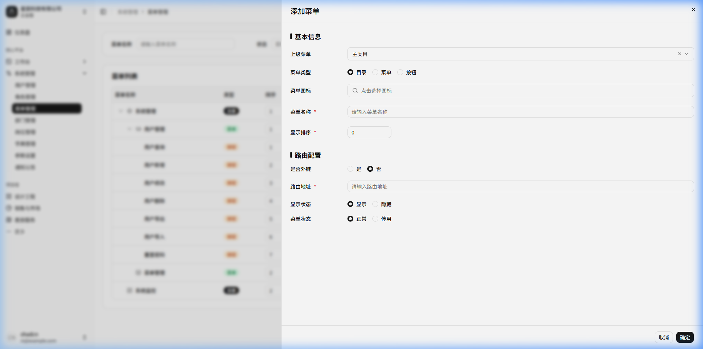
（参考原型图：点击“新增”按钮弹出的模态框）

**2. 功能说明**

- 支持按需配置三种不同类型的节点：**目录**（用于父级导航）、**菜单**（实际可访问的页面）、**按钮**（页面内的具体操作权限控制）。
- 根据所选“菜单类型”的不同，下方表单字段会进行动态显示或隐藏（例如：选择“按钮”时，无需配置图标和组件路径；选择“目录”时无需配置组件路径等）。

**3. 页面控件**

| 名称 | 类型 | 位置 | 事件 | 说明 |
| :--- | :--- | :--- | :--- | :--- |
| 上级菜单选择框 | TreeSelect| 基础信息区 | 选择(onChange) | 选择父级节点，根节点为“主类目” |
| 菜单类型单选 | RadioGroup | 基础信息区 | 选择(onChange) | 切换目录、菜单、按钮，联动其他字段显示 |
| 菜单图标选择器 | IconPicker | 基础信息区 | 选取(onSelect) | 提供图标库可视化选择（按钮类型无此项） |
| 菜单名称输入框 | Input | 基础信息区 | 输入(onInput) | 输入左侧导航栏显示的名称 |
| 显示排序输入框 | InputNumber| 基础信息区 | 输入(onInput) | 数字越小越靠前 |
| 是否外链单选 | RadioGroup | 路由配置区 | 选择(onChange) | 选择是/否，若是外链，路由地址需填 http 链接 |
| 路由地址输入框 | Input | 路由配置区 | 输入(onInput) | 浏览器访问路径，如 `user` |
| 组件路径输入框 | Input | 路由配置区 | 输入(onInput) | 前端源码中的页面相对路径（目录/按钮无此项） |
| 权限字符输入框 | Input | 路由配置区 | 输入(onInput) | 控制具体按钮的操作权限（如 system:user:add） |
| 路由参数输入框 | Input | 路由配置区 | 输入(onInput) | 访问路由时的默认传递参数 |
| 显示状态单选 | RadioGroup | 状态配置区 | 选择(onChange) | 控制菜单是否在左侧导航栏显示，但不影响访问权限 |
| 菜单状态单选 | RadioGroup | 状态配置区 | 选择(onChange) | 控制菜单是否正常可用，停用后将无法访问 |
| 取消按钮 | Button | 底部操作区 | 点击(onClick) | 关闭弹窗，不保存数据 |
| 确定按钮 | Button | 底部操作区 | 点击(onClick) | 校验必填项后提交保存 |

**4. 页面字段**

| 名称 | 数据类型 | 长度 | 允许操作 | 是否必输 | 录入方式 | 备注 |
| :--- | :--- | :--- | :--- | :--- | :--- | :--- |
| 上级菜单 | Number | - | 新增/修改 | 是 | 树形下拉 | |
| 菜单类型 | String | 1 | 新增/修改 | 是 | 单选框 | M目录/C菜单/F按钮 |
| 菜单图标 | String | 100 | 新增/修改 | 否 | 图标选取 | |
| 菜单名称 | String | 50 | 新增/修改 | 是 | 手工输入 | |
| 显示排序 | Number | 4 | 新增/修改 | 是 | 手工输入 | |
| 路由地址 | String | 200 | 新增/修改 | 是 | 手工输入 | 类型为按钮时不填 |
| 组件路径 | String | 255 | 新增/修改 | 否 | 手工输入 | 类型为菜单时必填 |
| 权限字符 | String | 100 | 新增/修改 | 否 | 手工输入 | |
| 显示状态 | String | 1 | 新增/修改 | 否 | 单选框 | 显示/隐藏，默认显示 |
| 菜单状态 | String | 1 | 新增/修改 | 否 | 单选框 | 正常/停用，默认正常 |

##### 角色管理

###### 功能描述

提供对系统角色的全面管理功能，包括角色的增删改查、数据导出以及角色菜单权限的动态分配，以支撑平台灵活的权限控制体系。

###### 业务流程

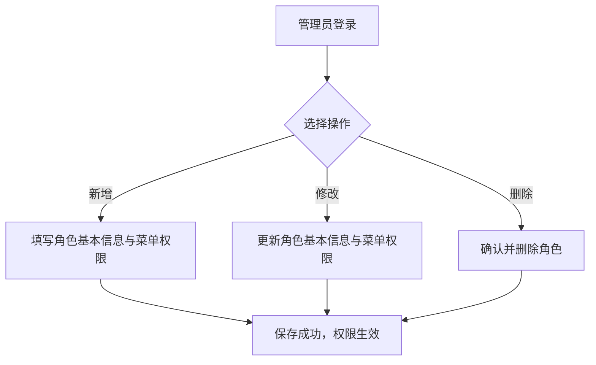
```mermaid
graph TD
    A["管理员登录"] --> B{"选择操作"}
    B -- 新增 --> C["填写角色基本信息与菜单权限"]
    B -- 修改 --> D["更新角色基本信息与菜单权限"]
    B -- 删除 --> E["确认并删除角色"]
    C --> F["保存成功，权限生效"]
    D --> F
    E --> F
```

###### 功能设计

###### 角色列表页面

**1. 页面原型**

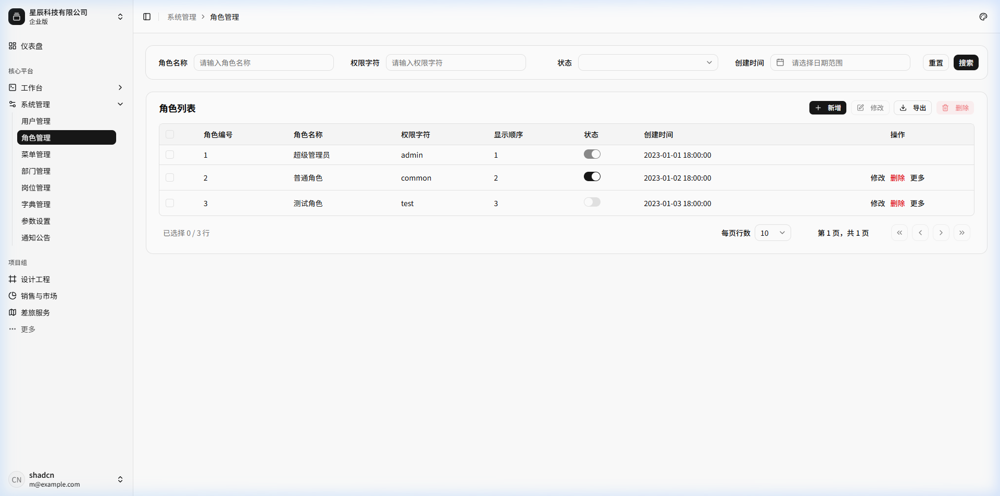
（来源参考：`http://localhost:5173/system/role`）

**2. 功能说明**

- 搜索：支持按角色名称、权限字符、状态、创建时间等条件组合查询。
- 新增：打开新增角色弹窗，录入角色信息及勾选菜单权限。
- 修改：选择一条记录后更新角色信息及权限。
- 删除：单选或多选记录后，提示并执行物理/逻辑删除。
- 导出：支持当前列表数据的导出。
- 快捷开关：支持在列表中直接通过开关组件切换角色的正常/停用状态。

**3. 页面控件**

| 名称 | 类型 | 位置 | 事件 | 说明 |
| :--- | :--- | :--- | :--- | :--- |
| 角色名称搜索框 | Input | 顶部搜索区 | 输入(onInput) | 支持模糊匹配 |
| 权限字符搜索框 | Input | 顶部搜索区 | 输入(onInput) | 支持精确或模糊匹配 |
| 状态选择框 | Select | 顶部搜索区 | 选择(onChange) | 下拉选单，如正常/停用 |
| 创建时间选择器 | DatePicker | 顶部搜索区 | 选择(onChange) | 日期范围选择 |
| 搜索按钮 | Button | 顶部搜索区 | 点击(onClick) | 触发查询接口刷新列表 |
| 重置按钮 | Button | 顶部搜索区 | 点击(onClick) | 清空搜索条件并刷新 |
| 新增按钮 | Button | 表格上方操作区 | 点击(onClick) | 弹出新增表单弹窗 |
| 修改按钮(批量) | Button | 表格上方操作区 | 点击(onClick) | 判断勾选单条数据，弹出编辑表单 |
| 删除按钮(批量) | Button | 表格上方操作区 | 点击(onClick) | 判断勾选数据，确认后删除 |
| 导出按钮 | Button | 表格上方操作区 | 点击(onClick) | 触发数据导出下载 |
| 状态开关 | Switch | 表格行状态列 | 切换(onChange) | 快速启停当前角色 |
| 修改按钮(单行) | Button | 表格行操作列 | 点击(onClick) | 弹出对应记录的编辑表单 |
| 删除按钮(单行) | Button | 表格行操作列 | 点击(onClick) | 二次确认后删除当前记录 |
| 更多按钮 | Dropdown | 表格行操作列 | 点击(onClick) | 包含数据权限、分配用户等更多操作 |

**4. 页面字段**

| 名称 | 数据类型 | 长度 | 允许操作 | 是否必输 | 录入方式 | 备注 |
| :--- | :--- | :--- | :--- | :--- | :--- | :--- |
| 角色编号 | Number | - | 查看 | 是 | 系统生成 | 表格列（主键） |
| 角色名称 | String | 30 | 查看 | 是 | 手工输入 | 表格列 |
| 权限字符 | String | 100 | 查看 | 是 | 手工输入 | 表格列 |
| 显示顺序 | Number | 4 | 查看 | 是 | 手工输入 | 表格列 |
| 状态 | Boolean/String | 1 | 修改 | 是 | 控件切换 | 表格列（正常/停用） |
| 创建时间 | DateTime | - | 查看 | 是 | 系统生成 | 表格列 |

---

###### 新增角色/修改角色

**1. 页面原型**

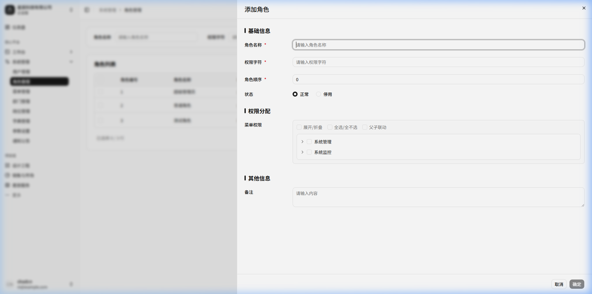
（参考原型图：点击“新增”按钮弹出的模态框）

**2. 功能说明**

- 基础信息录入：角色名称、权限字符、角色顺序以及状态选择。
- 菜单权限配置：以树状结构展示系统所有菜单与按钮，支持半选、全选、级联勾选，灵活配置角色拥有的操作权限。

**3. 页面控件**

| 名称 | 类型 | 位置 | 事件 | 说明 |
| :--- | :--- | :--- | :--- | :--- |
| 角色名称输入框 | Input | 基础信息区 | 输入(onInput) | 输入角色中文名称 |
| 权限字符输入框 | Input | 基础信息区 | 输入(onInput) | 配合系统鉴权的字符串（如admin） |
| 角色顺序输入框 | InputNumber | 基础信息区 | 输入(onInput) | 控制显示顺序 |
| 状态单选 | RadioGroup | 基础信息区 | 选择(onChange) | 正常或停用 |
| 菜单权限树 | Tree | 权限配置区 | 勾选(onCheck) | 支持全选/全不选、父子联动快捷操作 |
| 备注输入框 | TextArea | 基础信息区 | 输入(onInput) | 角色相关补充说明 |
| 取消按钮 | Button | 底部操作区 | 点击(onClick) | 关闭弹窗，不保存数据 |
| 确定按钮 | Button | 底部操作区 | 点击(onClick) | 校验必填项后提交保存 |

**4. 页面字段**

| 名称 | 数据类型 | 长度 | 允许操作 | 是否必输 | 录入方式 | 备注 |
| :--- | :--- | :--- | :--- | :--- | :--- | :--- |
| 角色名称 | String | 30 | 新增/修改 | 是 | 手工输入 | |
| 权限字符 | String | 100 | 新增/修改 | 是 | 手工输入 | |
| 角色顺序 | Number | 4 | 新增/修改 | 是 | 手工输入 | 必须为正整数 |
| 状态 | String | 1 | 新增/修改 | 否 | 单选框 | 默认为正常 |
| 菜单权限 | Array | - | 新增/修改 | 否 | 树形勾选 | 提交选中的菜单ID集合 |
| 备注 | String | 500 | 新增/修改 | 否 | 文本框 | |

---

###### 数据权限弹窗

**1. 页面原型**

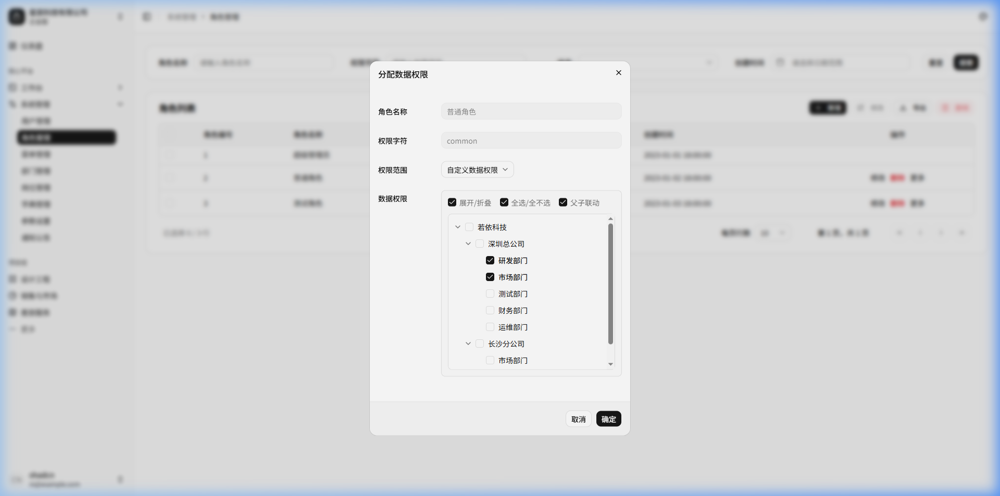
（参考原型图：点击操作列更多中“数据权限”弹出的模态框）

**2. 功能说明**

- 用于细化角色能查看和操作的数据范围（如仅本部门、全部数据等）。
- 基础信息只读展示，核心是通过下拉框选择权限范围。
- 当选择“自定义数据权限”时，会展示部门树，支持精确勾选特定部门的数据权限。

**3. 页面控件**

| 名称 | 类型 | 位置 | 事件 | 说明 |
| :--- | :--- | :--- | :--- | :--- |
| 角色名称输入框 | Input | 基础信息区 | - | 禁用状态，只读展示 |
| 权限字符输入框 | Input | 基础信息区 | - | 禁用状态，只读展示 |
| 权限范围选择框 | Select | 核心配置区 | 选择(onChange) | 下拉选单（全部/自定义/本部门等） |
| 数据权限树 | Tree | 核心配置区 | 勾选(onCheck) | 仅在“自定义”范围时出现，勾选具体部门 |
| 取消按钮 | Button | 底部操作区 | 点击(onClick) | 关闭弹窗，不保存数据 |
| 确定按钮 | Button | 底部操作区 | 点击(onClick) | 校验必填项后提交保存 |

**4. 页面字段**

| 名称 | 数据类型 | 长度 | 允许操作 | 是否必输 | 录入方式 | 备注 |
| :--- | :--- | :--- | :--- | :--- | :--- | :--- |
| 权限范围 | String | - | 修改 | 是 | 下拉选择 | |
| 部门权限 | Array | - | 修改 | 否 | 树形勾选 | 选中“自定义”时提交选中的部门ID集合 |

---

###### 分配用户页面

**1. 页面原型**

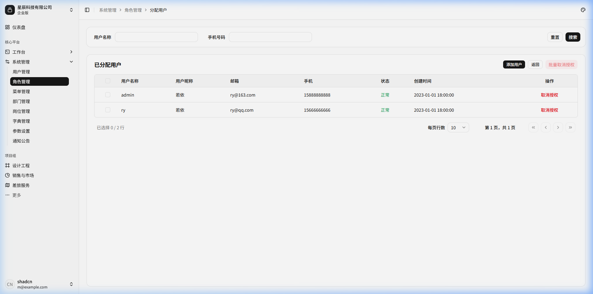
（参考原型图：点击操作列更多中“分配用户”跳转的页面）

**2. 功能说明**

- 用于管理当前角色下已绑定的用户列表。
- 支持批量或单个解除用户的该角色绑定（取消授权）。
- 支持通过弹窗快速添加新的用户到该角色中。

**3. 页面控件**

| 名称 | 类型 | 位置 | 事件 | 说明 |
| :--- | :--- | :--- | :--- | :--- |
| 用户名称搜索框 | Input | 顶部搜索区 | 输入(onInput) | 支持模糊匹配 |
| 手机号码搜索框 | Input | 顶部搜索区 | 输入(onInput) | 支持精确或模糊匹配 |
| 添加用户按钮 | Button | 表格上方操作区 | 点击(onClick) | 弹出可选用户列表弹窗以供分配 |
| 批量取消授权按钮 | Button | 表格上方操作区 | 点击(onClick) | 判断勾选数据，确认后批量解除绑定 |
| 返回按钮 | Button | 表格上方操作区 | 点击(onClick) | 返回角色管理主列表页面 |
| 取消授权按钮(单行) | Button | 表格行操作列 | 点击(onClick) | 二次确认后解除当前记录的绑定 |

**4. 页面字段**

| 名称 | 数据类型 | 长度 | 允许操作 | 是否必输 | 录入方式 | 备注 |
| :--- | :--- | :--- | :--- | :--- | :--- | :--- |
| 用户名称 | String | - | 查看 | - | - | 表格列 |
| 用户昵称 | String | - | 查看 | - | - | 表格列 |
| 邮箱 | String | - | 查看 | - | - | 表格列 |
| 手机 | String | - | 查看 | - | - | 表格列 |
| 状态 | String | - | 查看 | - | - | 表格列 |

##### 通知公告

###### 功能描述

提供向系统内部用户发布全站通知、公告信息的管理功能。支持公告信息的富文本编辑、状态控制，主要用于系统升级提示、业务通报、节假日放假通知等场景。

###### 业务流程

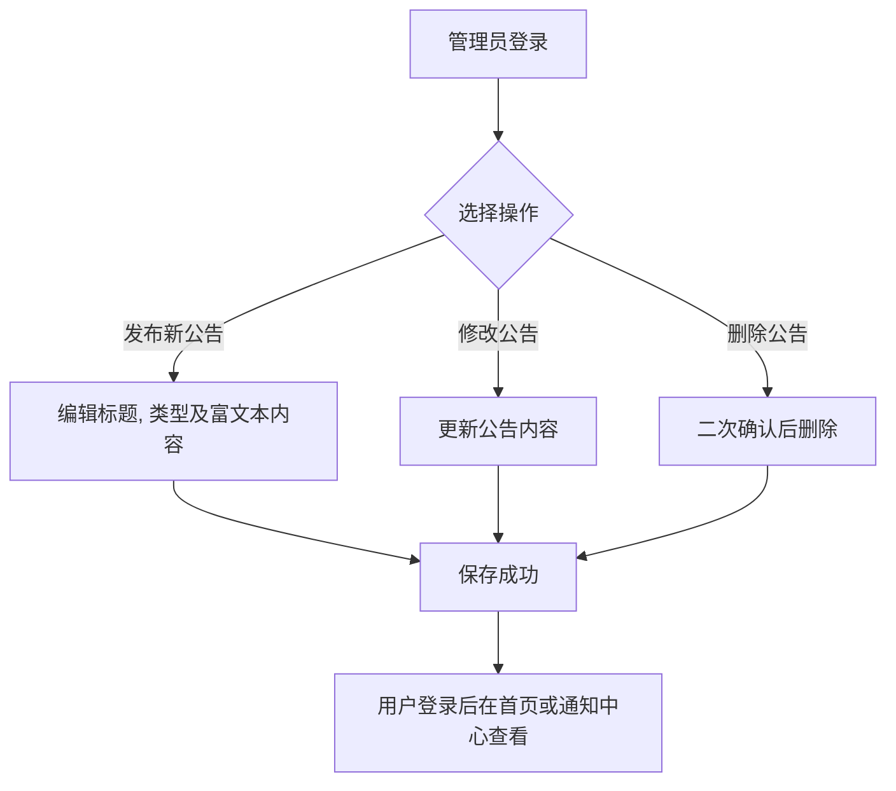
```mermaid
graph TD
    A["管理员登录"] --> B{"选择操作"}
    B -- 发布新公告 --> C["编辑标题, 类型及富文本内容"]
    B -- 修改公告 --> D["更新公告内容"]
    B -- 删除公告 --> E["二次确认后删除"]
    C --> F["保存成功"]
    D --> F
    E --> F
    F --> G[用户登录后在首页或通知中心查看]
```

###### 功能设计

###### 1. 通知公告列表页面

**1. 页面原型**

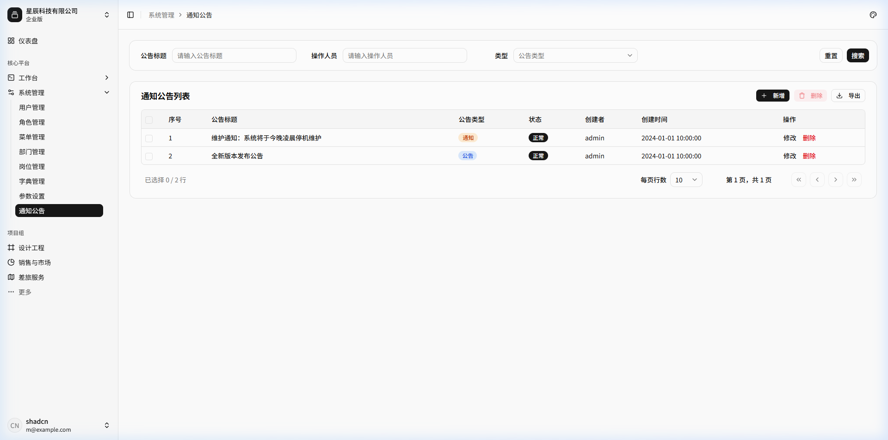
（来源参考：`http://localhost:5173/system/notice`）

**2. 功能说明**

- 搜索：支持按公告标题、操作人员、公告类型等进行过滤查询。
- 数据展示：展示所有的通知公告记录，默认按创建时间倒序排列。
- 权限隔离：普通用户只能查看已发布正常的公告，管理员可在此页面管理所有状态的公告。

**3. 页面控件**

| 名称 | 类型 | 位置 | 事件 | 说明 |
| :--- | :--- | :--- | :--- | :--- |
| 公告标题搜索框 | Input | 顶部搜索区 | 输入(onInput) | 模糊匹配 |
| 操作人员搜索框 | Input | 顶部搜索区 | 输入(onInput) | 模糊匹配发布人 |
| 公告类型下拉框 | Select | 顶部搜索区 | 选择(onChange) | 通知/公告 |
| 搜索/重置按钮 | Button | 顶部搜索区 | 点击(onClick) | 触发查询/清空 |
| 新增/删除按钮 | Button | 表格操作区 | 点击(onClick) | 基础 CRUD 操作 |
| 公告标题链接 | Link | 表格行列 | 点击(onClick) | 点击列表中的公告标题，弹出该公告的详情页面查看完整内容 |
| 修改/删除按钮(单行) | Button | 表格行操作列 | 点击(onClick) | 对单条公告的操作 |

**4. 页面字段**

| 名称 | 数据类型 | 长度 | 允许操作 | 是否必输 | 录入方式 | 备注 |
| :--- | :--- | :--- | :--- | :--- | :--- | :--- |
| 序号 | Number | - | 查看 | 是 | 系统生成 | |
| 公告标题 | String | 100 | 查看 | 是 | 手工输入 | |
| 公告类型 | Tag | - | 查看 | 是 | - | 通常区分为通知/公告 |
| 状态 | Tag | - | 查看 | - | - | 正常/关闭 |
| 创建者 | String | 50 | 查看 | - | - | |
| 创建时间 | DateTime | - | 查看 | 是 | 系统生成 | |

---

###### 2. 新增/修改通知公告

**1. 页面原型**

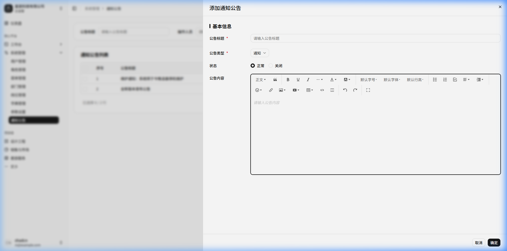

**2. 页面字段**

| 名称 | 数据类型 | 长度 | 允许操作 | 是否必输 | 录入方式 | 备注 |
| :--- | :--- | :--- | :--- | :--- | :--- | :--- |
| 公告标题 | String | 100 | 新增/修改 | 是 | 手工输入 | |
| 公告类型 | String | 1 | 新增/修改 | 是 | 单选/下拉 | 关联字典表 |
| 状态 | String | 1 | 新增/修改 | 否 | 单选框 | 正常/关闭，关闭后不再前台展示 |
| 内容 | RichText | - | 新增/修改 | 否 | 富文本编辑器 | 支持图文排版、超链接插入等 |

---

###### 3. 公告详情页面

**1. 页面原型**

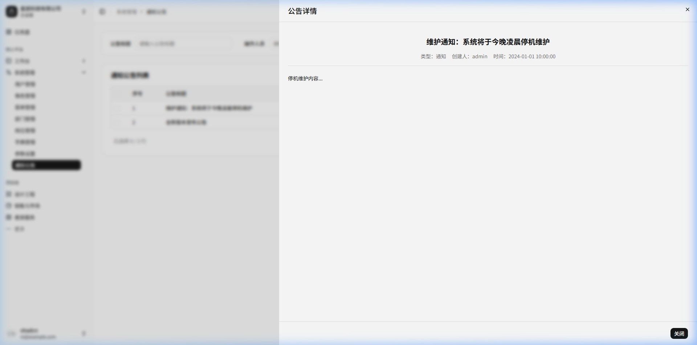
（参考原型图：点击列表中公告标题弹出的详情模态框）

**2. 功能说明**

- 用于以只读模式向用户展示完整的公告信息，包括富文本内容、发布人和时间。
- 界面不包含任何可编辑的输入框，仅供查阅。

**3. 页面控件**

| 名称 | 类型 | 位置 | 事件 | 说明 |
| :--- | :--- | :--- | :--- | :--- |
| 关闭按钮 | Button | 底部操作区 | 点击(onClick) | 关闭详情弹窗 |

**4. 页面字段**

| 名称 | 数据类型 | 长度 | 允许操作 | 是否必输 | 录入方式 | 备注 |
| :--- | :--- | :--- | :--- | :--- | :--- | :--- |
| 公告标题 | String | - | 查看 | - | - | 大字号展示 |
| 基础信息 | String | - | 查看 | - | - | 包含公告类型、创建者和创建时间 |
| 公告内容 | RichText | - | 查看 | - | - | 富文本渲染展示区 |

##### 部门管理

###### 功能描述

提供对系统企业组织架构的统一管理功能。支持按树形结构管理各级部门/公司的增删改查，为用户分配部门归属及数据权限控制提供基础支撑。

###### 业务流程

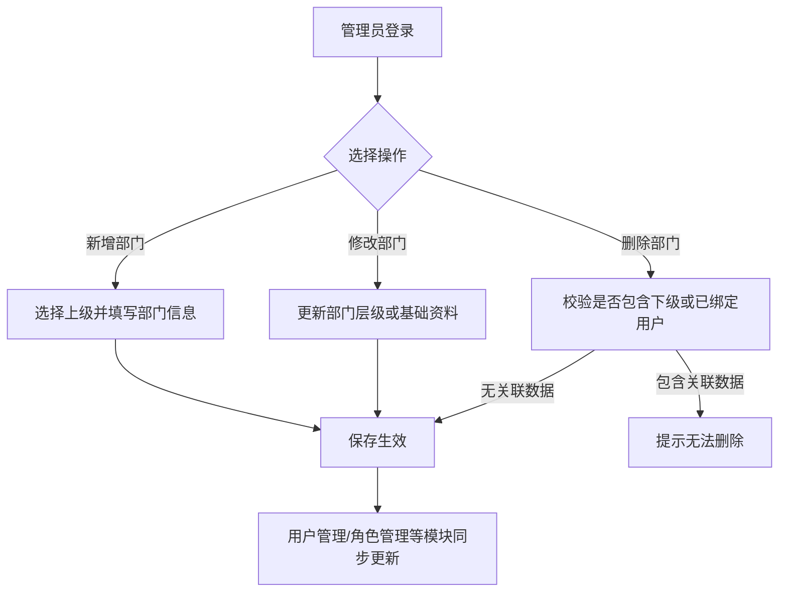
```mermaid
graph TD
    A[管理员登录] --> B{选择操作}
    B -- 新增部门 --> C[选择上级并填写部门信息]
    B -- 修改部门 --> D[更新部门层级或基础资料]
    B -- 删除部门 --> E[校验是否包含下级或已绑定用户]
    C --> F[保存生效]
    D --> F
    E -- 包含关联数据 --> G[提示无法删除]
    E -- 无关联数据 --> F
    F --> H[用户管理/角色管理等模块同步更新]
```

###### 功能设计

###### 部门列表页面

**1. 页面原型**

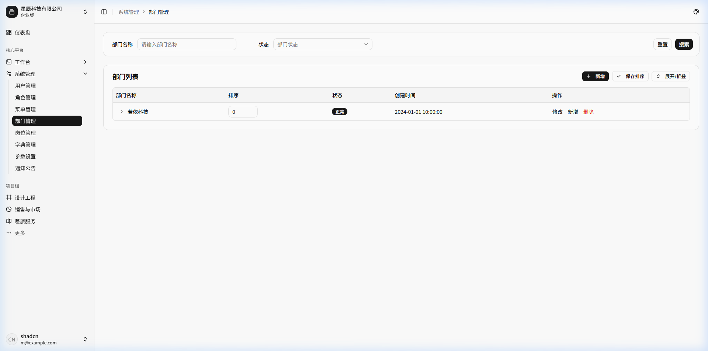
（来源参考：`http://localhost:5173/system/dept`）

**2. 功能说明**

- 搜索：支持按部门名称、状态等条件进行过滤查询。
- 层级展示：采用树形表格(TreeTable)直观展示部门的父子组织关系，支持一键全部展开/折叠。
- 行内操作：支持在当前层级快速新增下级部门，或对当前部门进行修改、删除。

**3. 页面控件**

| 名称 | 类型 | 位置 | 事件 | 说明 |
| :--- | :--- | :--- | :--- | :--- |
| 部门名称搜索框 | Input | 顶部搜索区 | 输入(onInput) | 支持模糊匹配 |
| 状态选择框 | Select | 顶部搜索区 | 选择(onChange) | 下拉选单，如正常/停用 |
| 搜索按钮 | Button | 顶部搜索区 | 点击(onClick) | 触发查询接口刷新列表 |
| 重置按钮 | Button | 顶部搜索区 | 点击(onClick) | 清空搜索条件并刷新 |
| 新增按钮 | Button | 表格上方操作区 | 点击(onClick) | 弹出新增顶级或同级部门的表单弹窗 |
| 展开/折叠按钮 | Button | 表格上方操作区 | 点击(onClick) | 控制整个树形表格的所有层级展开与收缩 |
| 修改按钮(单行) | Button | 表格行操作列 | 点击(onClick) | 弹出对应记录的编辑表单 |
| 新增按钮(单行) | Button | 表格行操作列 | 点击(onClick) | 弹出新增表单，且上级部门默认选中当前行 |
| 删除按钮(单行) | Button | 表格行操作列 | 点击(onClick) | 若存在下级部门或已绑定用户则拦截，否则二次确认后删除 |

**4. 页面字段**

| 名称 | 数据类型 | 长度 | 允许操作 | 是否必输 | 录入方式 | 备注 |
| :--- | :--- | :--- | :--- | :--- | :--- | :--- |
| 部门名称 | String | 50 | 查看 | 是 | - | 树形节点展示 |
| 排序 | Number | 4 | 查看 | 是 | - | 数字越小越靠前 |
| 状态 | Tag | - | 查看 | - | - | 正常/停用 |
| 创建时间 | DateTime | - | 查看 | 是 | - | 系统生成 |

---

###### 新增部门/修改部门

**1. 页面原型**

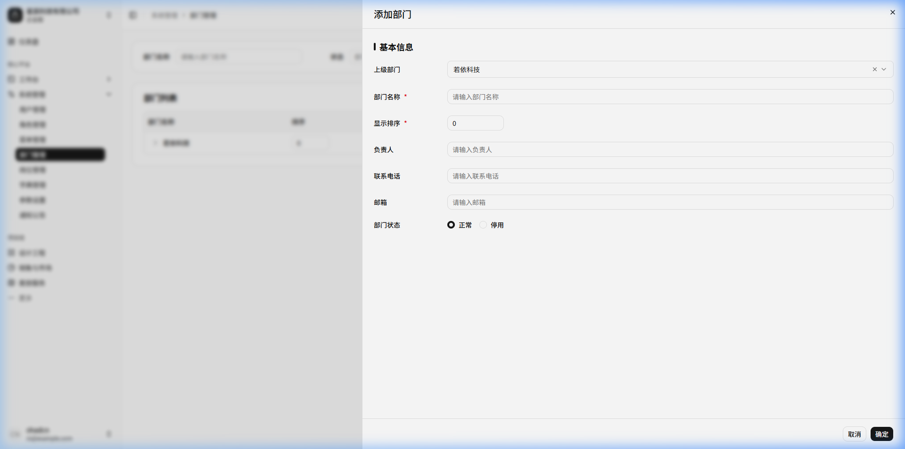
（参考原型图：点击“新增”按钮弹出的模态框）

**2. 功能说明**

- 用于录入或更新具体的部门基础资料信息。
- 支持通过重新选择“上级部门”来实现部门组织架构的调动（平移或降级），但禁止将部门挂载到自身的下级。

**3. 页面控件**

| 名称 | 类型 | 位置 | 事件 | 说明 |
| :--- | :--- | :--- | :--- | :--- |
| 上级部门选择框 | TreeSelect| 基础信息区 | 选择(onChange) | 树形下拉选择，根节点可选择系统默认顶级节点 |
| 部门名称输入框 | Input | 基础信息区 | 输入(onInput) | 部门或公司名称 |
| 显示排序输入框 | InputNumber| 基础信息区 | 输入(onInput) | 控制同级部门的显示顺序 |
| 负责人输入框 | Input | 扩展信息区 | 输入(onInput) | 该部门的主要负责人姓名 |
| 联系电话输入框 | Input | 扩展信息区 | 输入(onInput) | 负责人的联系电话 |
| 邮箱输入框 | Input | 扩展信息区 | 输入(onInput) | 负责人的电子邮箱 |
| 部门状态单选 | RadioGroup | 基础信息区 | 选择(onChange) | 正常或停用 |
| 取消按钮 | Button | 底部操作区 | 点击(onClick) | 关闭弹窗，不保存数据 |
| 确定按钮 | Button | 底部操作区 | 点击(onClick) | 校验必填项与格式后提交保存 |

**4. 页面字段**

| 名称 | 数据类型 | 长度 | 允许操作 | 是否必输 | 录入方式 | 备注 |
| :--- | :--- | :--- | :--- | :--- | :--- | :--- |
| 上级部门 | Number | - | 新增/修改 | 是 | 树形下拉 | |
| 部门名称 | String | 50 | 新增/修改 | 是 | 手工输入 | |
| 显示排序 | Number | 4 | 新增/修改 | 是 | 手工输入 | 默认从0开始 |
| 负责人 | String | 20 | 新增/修改 | 否 | 手工输入 | |
| 联系电话 | String | 11 | 新增/修改 | 否 | 手工输入 | 支持手机/固话格式校验 |
| 邮箱 | String | 50 | 新增/修改 | 否 | 手工输入 | 需符合邮箱格式校验 |
| 部门状态 | String | 1 | 新增/修改 | 否 | 单选框 | 正常/停用，默认正常 |

