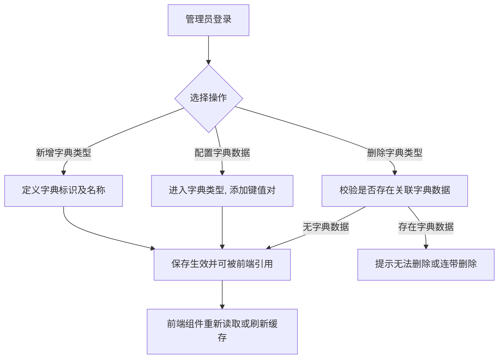
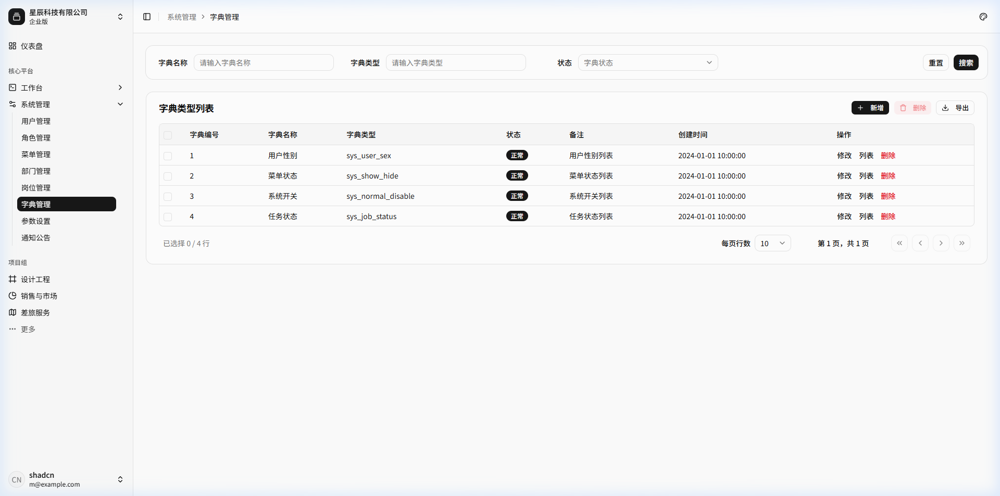
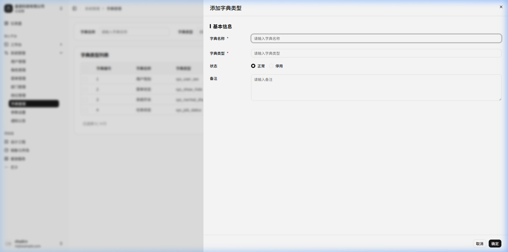
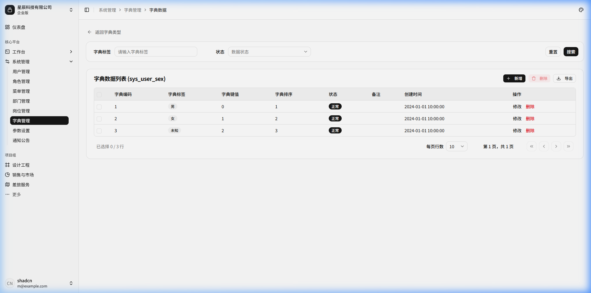
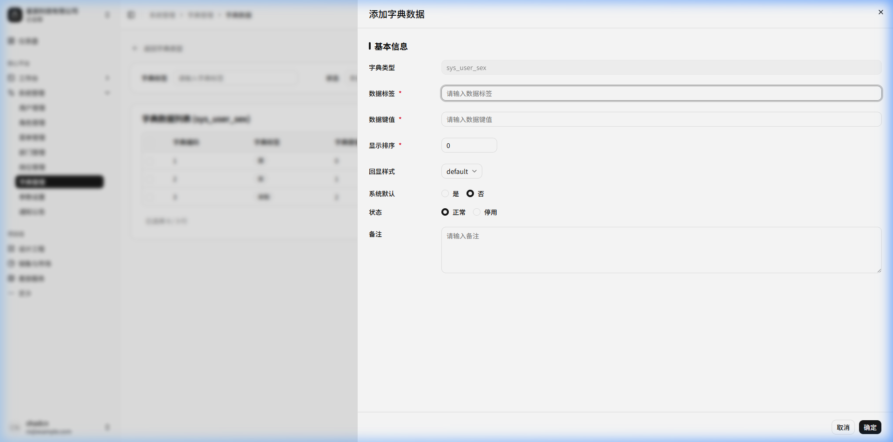

# 字典管理

## 功能描述
<!-- 描述该模块或页面的核心功能和业务目标 -->
提供系统中固定枚举数据（如下拉框选项、状态值、业务类型等）的集中管理。通过“字典类型”与“字典数据”两级结构维护，业务表只需保存字典键值，降低数据冗余，并支持前端组件动态读取渲染。

## 业务流程
<!-- 描述该模块内的具体业务流转过程，可包含流程图和流转说明 -->

## 功能设计

### 1. 字典类型列表页面

**1. 页面原型**
<!-- 插入该页面的原型图或UI设计图 -->

（来源参考：`http://localhost:5173/system/dict`）

**2. 功能说明**
<!-- 详细描述页面上的各个功能按钮、操作逻辑及数据流转规则 -->
- 搜索：支持按字典名称、字典类型、状态、创建时间等进行组合查询。
- 缓存管理：提供“刷新缓存”按钮，修改字典后更新 Redis/本地 缓存。
- 数据维护：点击具体行进入或点击“列表”进入对应的字典数据维护页面。

**3. 页面控件**
<!-- 详细列出页面上的控件元素及其交互事件 -->
| 名称 | 类型 | 位置 | 事件 | 说明 |
| :--- | :--- | :--- | :--- | :--- |
| 字典名称/类型搜索框 | Input | 顶部搜索区 | 输入(onInput) | 模糊匹配 |
| 状态选择框 | Select | 顶部搜索区 | 选择(onChange) | 正常/停用 |
| 搜索/重置按钮 | Button | 顶部搜索区 | 点击(onClick) | 触发查询/清空 |
| 新增/修改/删除按钮 | Button | 表格操作区 | 点击(onClick) | 基础 CRUD 操作 |
| 刷新缓存按钮 | Button | 表格上方操作区 | 点击(onClick) | 强制同步最新字典数据到缓存 |
| 修改/删除按钮(单行) | Button | 表格行操作列 | 点击(onClick) | 对单条字典类型的操作 |
| 字典类型链接 | Link | 表格行 | 点击(onClick) | 跳转至该类型的“字典数据”管理列表 |

**4. 页面字段**
<!-- 详细列出页面或表单中涉及的核心数据字段及其规则 -->
| 名称 | 数据类型 | 长度 | 允许操作 | 是否必输 | 录入方式 | 备注 |
| :--- | :--- | :--- | :--- | :--- | :--- | :--- |
| 字典主键 | Number | - | 查看 | 是 | 系统生成 | |
| 字典名称 | String | 100 | 查看 | 是 | 手工输入 | |
| 字典类型 | String | 100 | 查看 | 是 | 手工输入 | 唯一标识符，如 `sys_user_sex` |
| 状态 | Tag | - | 查看 | - | - | 正常/停用 |

---

### 2. 新增/修改字典类型

**1. 页面原型**
<!-- 插入该页面的原型图或UI设计图 -->

**2. 页面字段**
<!-- 详细列出页面或表单中涉及的核心数据字段及其规则 -->
| 名称 | 数据类型 | 长度 | 允许操作 | 是否必输 | 录入方式 | 备注 |
| :--- | :--- | :--- | :--- | :--- | :--- | :--- |
| 字典名称 | String | 100 | 新增/修改 | 是 | 手工输入 | |
| 字典类型 | String | 100 | 新增/修改 | 是 | 手工输入 | 建议使用全英文字母及下划线 |
| 状态 | String | 1 | 新增/修改 | 否 | 单选框 | |
| 备注 | String | 500 | 新增/修改 | 否 | 多行文本 | |

---

### 3. 字典数据列表页面

**1. 页面原型**
<!-- 插入该页面的原型图或UI设计图 -->

（参考原型图：点击字典类型后进入的明细页面）

**2. 功能说明**
<!-- 详细描述页面上的各个功能按钮、操作逻辑及数据流转规则 -->
- 显示某个“字典类型”下的所有可选项（键值对）。
- 支持修改默认选中项、排序和显示样式（如 Element/Shadcn 组件的不同颜色 Tag）。

**3. 页面控件**
<!-- 详细列出页面上的控件元素及其交互事件 -->
| 名称 | 类型 | 位置 | 事件 | 说明 |
| :--- | :--- | :--- | :--- | :--- |
| 字典类型下拉框 | Select | 顶部搜索区 | 选择(onChange) | 可在列表页直接切换查看其他字典类型 |
| 数据标签/键值搜索 | Input | 顶部搜索区 | 输入(onInput) | 模糊或精确匹配 |
| 状态选择框 | Select | 顶部搜索区 | 选择(onChange) | 正常/停用 |
| 新增/修改/删除按钮 | Button | 表格操作区 | 点击(onClick) | 针对键值对的基础操作 |

**4. 页面字段**
<!-- 详细列出页面或表单中涉及的核心数据字段及其规则 -->
| 名称 | 数据类型 | 长度 | 允许操作 | 是否必输 | 录入方式 | 备注 |
| :--- | :--- | :--- | :--- | :--- | :--- | :--- |
| 字典标签 | String | 100 | 查看 | 是 | - | 前端展示的中文名，如“男” |
| 字典键值 | String | 100 | 查看 | 是 | - | 存入数据库的实际值，如“0” |
| 字典排序 | Number | 4 | 查看 | 是 | - | |
| 状态 | Tag | - | 查看 | - | - | |

---

### 4. 新增/修改字典数据

**1. 页面原型**
<!-- 插入该页面的原型图或UI设计图 -->

**2. 页面字段**
<!-- 详细列出页面或表单中涉及的核心数据字段及其规则 -->
| 名称 | 数据类型 | 长度 | 允许操作 | 是否必输 | 录入方式 | 备注 |
| :--- | :--- | :--- | :--- | :--- | :--- | :--- |
| 字典类型 | String | 100 | 查看 | 是 | 系统带入 | 只读，对应所属类型 |
| 数据标签 | String | 100 | 新增/修改 | 是 | 手工输入 | |
| 数据键值 | String | 100 | 新增/修改 | 是 | 手工输入 | |
| 样式属性 | String | 100 | 新增/修改 | 否 | 手工输入 | 控制 Tag 的 class 或 css |
| 回显样式 | Select | 100 | 新增/修改 | 否 | 下拉选择 | 预设主题（primary/success/info等） |
| 显示排序 | Number | 4 | 新增/修改 | 是 | 手工输入 | |
| 状态 | String | 1 | 新增/修改 | 否 | 单选框 | 正常/停用 |
| 备注 | String | 500 | 新增/修改 | 否 | 多行文本 | |
