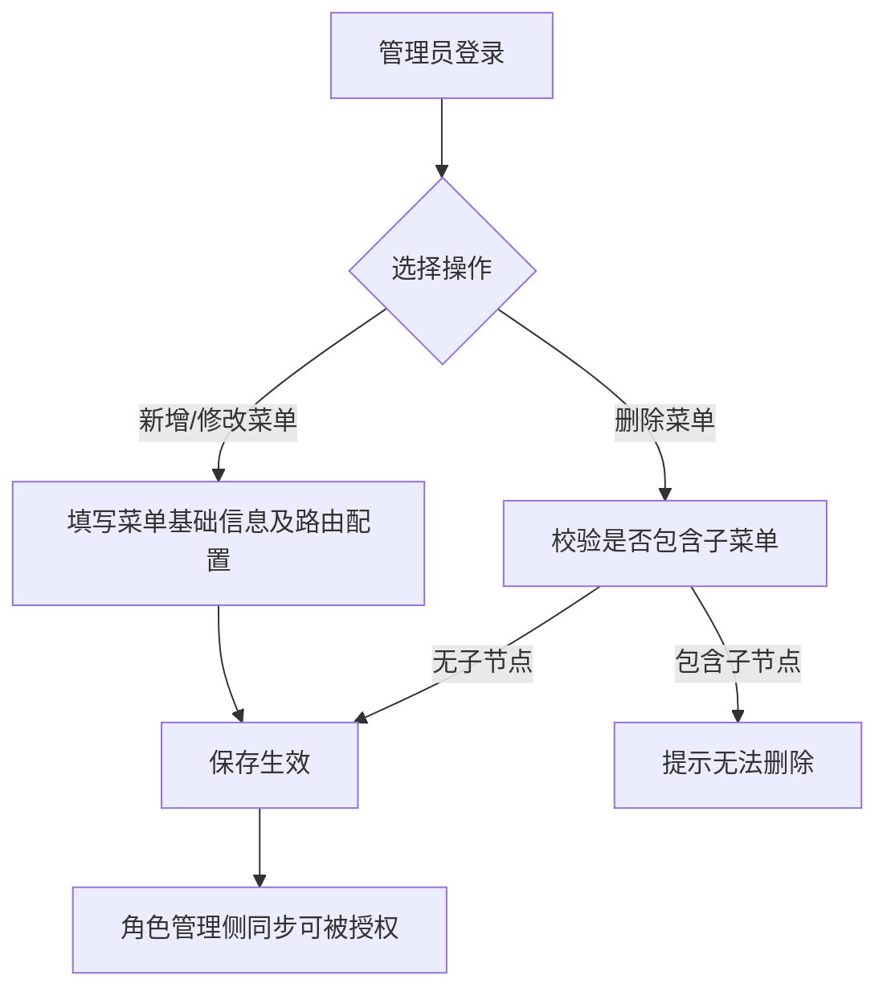

# 菜单管理

## 功能描述
<!-- 描述该模块或页面的核心功能和业务目标 -->
提供对系统左侧导航菜单、页面按钮权限标识的统一配置管理。支持树形层级结构的无限极菜单分类，能够灵活定义页面组件路径、路由地址及控制菜单的显示与隐藏状态。

## 业务流程
<!-- 描述该模块内的具体业务流转过程，可包含流程图和流转说明 -->

## 功能设计

### 菜单列表页面

**1. 页面原型**
<!-- 插入该页面的原型图或UI设计图 -->

（来源参考：`http://localhost:5173/system/menu`）

**2. 功能说明**
<!-- 详细描述页面上的各个功能按钮、操作逻辑及数据流转规则 -->
- 搜索：支持按菜单名称、状态等条件进行过滤查询。
- 层级展示：采用树形表格(TreeTable)展示菜单的父子层级关系，支持一键全部展开/折叠。
- 行内操作：在表格对应行可直接进行修改、新增子菜单或删除操作。
- 排序功能：支持行内直接输入数字调整排序，并提供顶部“保存排序”按钮进行统一保存生效。

**3. 页面控件**
<!-- 详细列出页面上的控件元素及其交互事件 -->
| 名称 | 类型 | 位置 | 事件 | 说明 |
| :--- | :--- | :--- | :--- | :--- |
| 菜单名称搜索框 | Input | 顶部搜索区 | 输入(onInput) | 支持模糊匹配 |
| 状态选择框 | Select | 顶部搜索区 | 选择(onChange) | 下拉选单，如正常/停用 |
| 搜索按钮 | Button | 顶部搜索区 | 点击(onClick) | 触发查询接口刷新列表 |
| 重置按钮 | Button | 顶部搜索区 | 点击(onClick) | 清空搜索条件并刷新 |
| 新增按钮 | Button | 表格上方操作区 | 点击(onClick) | 弹出新增一级菜单表单弹窗 |
| 保存排序按钮 | Button | 表格上方操作区 | 点击(onClick) | 批量提交表格内修改过的排序值 |
| 展开/折叠按钮 | Button | 表格上方操作区 | 点击(onClick) | 控制整个树形表格的所有层级展开与收缩 |
| 修改按钮(单行) | Button | 表格行操作列 | 点击(onClick) | 弹出对应记录的编辑表单 |
| 新增按钮(单行) | Button | 表格行操作列 | 点击(onClick) | 弹出新增表单，且上级菜单默认选中当前行 |
| 删除按钮(单行) | Button | 表格行操作列 | 点击(onClick) | 若存在子节点则拦截，否则二次确认后删除当前记录 |

**4. 页面字段**
<!-- 详细列出页面或表单中涉及的核心数据字段及其规则 -->
| 名称 | 数据类型 | 长度 | 允许操作 | 是否必输 | 录入方式 | 备注 |
| :--- | :--- | :--- | :--- | :--- | :--- | :--- |
| 菜单名称 | String | 50 | 查看 | 是 | - | 树形节点展示 |
| 类型 | Tag | - | 查看 | - | - | 区分目录/菜单/按钮 |
| 排序 | Number | 4 | 修改 | 是 | 行内输入 | 表格支持直接编辑 |
| 权限标识 | String | 100 | 查看 | 否 | - | 前端组件鉴权字符串 |
| 组件路径 | String | 255 | 查看 | 否 | - | 对应前端文件相对路径 |
| 状态 | Tag | - | 查看 | - | - | 正常/停用 |

---

### 新增菜单/修改菜单

**1. 页面原型**
<!-- 插入该页面的原型图或UI设计图 -->

（参考原型图：点击“新增”按钮弹出的模态框）

**2. 功能说明**
<!-- 详细描述页面上的各个功能按钮、操作逻辑及数据流转规则 -->
- 支持按需配置三种不同类型的节点：**目录**（用于父级导航）、**菜单**（实际可访问的页面）、**按钮**（页面内的具体操作权限控制）。
- 根据所选“菜单类型”的不同，下方表单字段会进行动态显示或隐藏（例如：选择“按钮”时，无需配置图标和组件路径；选择“目录”时无需配置组件路径等）。

**3. 页面控件**
<!-- 详细列出页面上的控件元素及其交互事件 -->
| 名称 | 类型 | 位置 | 事件 | 说明 |
| :--- | :--- | :--- | :--- | :--- |
| 上级菜单选择框 | TreeSelect| 基础信息区 | 选择(onChange) | 选择父级节点，根节点为“主类目” |
| 菜单类型单选 | RadioGroup | 基础信息区 | 选择(onChange) | 切换目录、菜单、按钮，联动其他字段显示 |
| 菜单图标选择器 | IconPicker | 基础信息区 | 选取(onSelect) | 提供图标库可视化选择（按钮类型无此项） |
| 菜单名称输入框 | Input | 基础信息区 | 输入(onInput) | 输入左侧导航栏显示的名称 |
| 显示排序输入框 | InputNumber| 基础信息区 | 输入(onInput) | 数字越小越靠前 |
| 是否外链单选 | RadioGroup | 路由配置区 | 选择(onChange) | 选择是/否，若是外链，路由地址需填 http 链接 |
| 路由地址输入框 | Input | 路由配置区 | 输入(onInput) | 浏览器访问路径，如 `user` |
| 组件路径输入框 | Input | 路由配置区 | 输入(onInput) | 前端源码中的页面相对路径（目录/按钮无此项） |
| 权限字符输入框 | Input | 路由配置区 | 输入(onInput) | 控制具体按钮的操作权限（如 system:user:add） |
| 路由参数输入框 | Input | 路由配置区 | 输入(onInput) | 访问路由时的默认传递参数 |
| 显示状态单选 | RadioGroup | 状态配置区 | 选择(onChange) | 控制菜单是否在左侧导航栏显示，但不影响访问权限 |
| 菜单状态单选 | RadioGroup | 状态配置区 | 选择(onChange) | 控制菜单是否正常可用，停用后将无法访问 |
| 取消按钮 | Button | 底部操作区 | 点击(onClick) | 关闭弹窗，不保存数据 |
| 确定按钮 | Button | 底部操作区 | 点击(onClick) | 校验必填项后提交保存 |

**4. 页面字段**
<!-- 详细列出页面或表单中涉及的核心数据字段及其规则 -->
| 名称 | 数据类型 | 长度 | 允许操作 | 是否必输 | 录入方式 | 备注 |
| :--- | :--- | :--- | :--- | :--- | :--- | :--- |
| 上级菜单 | Number | - | 新增/修改 | 是 | 树形下拉 | |
| 菜单类型 | String | 1 | 新增/修改 | 是 | 单选框 | M目录/C菜单/F按钮 |
| 菜单图标 | String | 100 | 新增/修改 | 否 | 图标选取 | |
| 菜单名称 | String | 50 | 新增/修改 | 是 | 手工输入 | |
| 显示排序 | Number | 4 | 新增/修改 | 是 | 手工输入 | |
| 路由地址 | String | 200 | 新增/修改 | 是 | 手工输入 | 类型为按钮时不填 |
| 组件路径 | String | 255 | 新增/修改 | 否 | 手工输入 | 类型为菜单时必填 |
| 权限字符 | String | 100 | 新增/修改 | 否 | 手工输入 | |
| 显示状态 | String | 1 | 新增/修改 | 否 | 单选框 | 显示/隐藏，默认显示 |
| 菜单状态 | String | 1 | 新增/修改 | 否 | 单选框 | 正常/停用，默认正常 |
