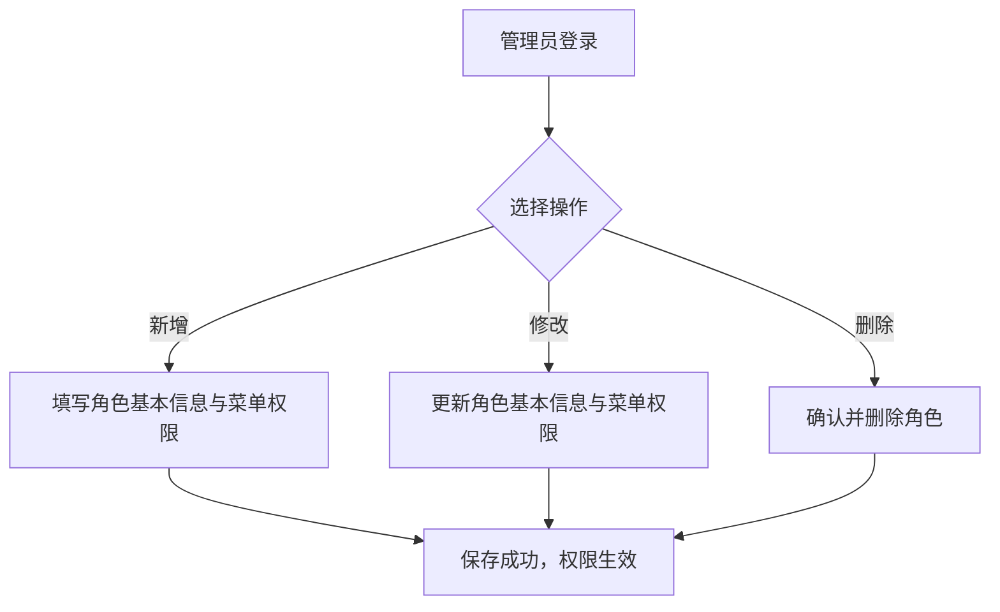

# 角色管理

## 功能描述
<!-- 描述该模块或页面的核心功能和业务目标 -->
提供对系统角色的全面管理功能，包括角色的增删改查、数据导出以及角色菜单权限的动态分配，以支撑平台灵活的权限控制体系。

## 业务流程
<!-- 描述该模块内的具体业务流转过程，可包含流程图和流转说明 -->

## 功能设计

### 角色列表页面

**1. 页面原型**
<!-- 插入该页面的原型图或UI设计图 -->

（来源参考：`http://localhost:5173/system/role`）

**2. 功能说明**
<!-- 详细描述页面上的各个功能按钮、操作逻辑及数据流转规则 -->
- 搜索：支持按角色名称、权限字符、状态、创建时间等条件组合查询。
- 新增：打开新增角色弹窗，录入角色信息及勾选菜单权限。
- 修改：选择一条记录后更新角色信息及权限。
- 删除：单选或多选记录后，提示并执行物理/逻辑删除。
- 导出：支持当前列表数据的导出。
- 快捷开关：支持在列表中直接通过开关组件切换角色的正常/停用状态。

**3. 页面控件**
<!-- 详细列出页面上的控件元素及其交互事件 -->
| 名称 | 类型 | 位置 | 事件 | 说明 |
| :--- | :--- | :--- | :--- | :--- |
| 角色名称搜索框 | Input | 顶部搜索区 | 输入(onInput) | 支持模糊匹配 |
| 权限字符搜索框 | Input | 顶部搜索区 | 输入(onInput) | 支持精确或模糊匹配 |
| 状态选择框 | Select | 顶部搜索区 | 选择(onChange) | 下拉选单，如正常/停用 |
| 创建时间选择器 | DatePicker | 顶部搜索区 | 选择(onChange) | 日期范围选择 |
| 搜索按钮 | Button | 顶部搜索区 | 点击(onClick) | 触发查询接口刷新列表 |
| 重置按钮 | Button | 顶部搜索区 | 点击(onClick) | 清空搜索条件并刷新 |
| 新增按钮 | Button | 表格上方操作区 | 点击(onClick) | 弹出新增表单弹窗 |
| 修改按钮(批量) | Button | 表格上方操作区 | 点击(onClick) | 判断勾选单条数据，弹出编辑表单 |
| 删除按钮(批量) | Button | 表格上方操作区 | 点击(onClick) | 判断勾选数据，确认后删除 |
| 导出按钮 | Button | 表格上方操作区 | 点击(onClick) | 触发数据导出下载 |
| 状态开关 | Switch | 表格行状态列 | 切换(onChange) | 快速启停当前角色 |
| 修改按钮(单行) | Button | 表格行操作列 | 点击(onClick) | 弹出对应记录的编辑表单 |
| 删除按钮(单行) | Button | 表格行操作列 | 点击(onClick) | 二次确认后删除当前记录 |
| 更多按钮 | Dropdown | 表格行操作列 | 点击(onClick) | 包含数据权限、分配用户等更多操作 |

**4. 页面字段**
<!-- 详细列出页面或表单中涉及的核心数据字段及其规则 -->
| 名称 | 数据类型 | 长度 | 允许操作 | 是否必输 | 录入方式 | 备注 |
| :--- | :--- | :--- | :--- | :--- | :--- | :--- |
| 角色编号 | Number | - | 查看 | 是 | 系统生成 | 表格列（主键） |
| 角色名称 | String | 30 | 查看 | 是 | 手工输入 | 表格列 |
| 权限字符 | String | 100 | 查看 | 是 | 手工输入 | 表格列 |
| 显示顺序 | Number | 4 | 查看 | 是 | 手工输入 | 表格列 |
| 状态 | Boolean/String | 1 | 修改 | 是 | 控件切换 | 表格列（正常/停用） |
| 创建时间 | DateTime | - | 查看 | 是 | 系统生成 | 表格列 |

---

### 新增角色/修改角色

**1. 页面原型**
<!-- 插入该页面的原型图或UI设计图 -->

（参考原型图：点击“新增”按钮弹出的模态框）

**2. 功能说明**
<!-- 详细描述页面上的各个功能按钮、操作逻辑及数据流转规则 -->
- 基础信息录入：角色名称、权限字符、角色顺序以及状态选择。
- 菜单权限配置：以树状结构展示系统所有菜单与按钮，支持半选、全选、级联勾选，灵活配置角色拥有的操作权限。

**3. 页面控件**
<!-- 详细列出页面上的控件元素及其交互事件 -->
| 名称 | 类型 | 位置 | 事件 | 说明 |
| :--- | :--- | :--- | :--- | :--- |
| 角色名称输入框 | Input | 基础信息区 | 输入(onInput) | 输入角色中文名称 |
| 权限字符输入框 | Input | 基础信息区 | 输入(onInput) | 配合系统鉴权的字符串（如admin） |
| 角色顺序输入框 | InputNumber | 基础信息区 | 输入(onInput) | 控制显示顺序 |
| 状态单选 | RadioGroup | 基础信息区 | 选择(onChange) | 正常或停用 |
| 菜单权限树 | Tree | 权限配置区 | 勾选(onCheck) | 支持全选/全不选、父子联动快捷操作 |
| 备注输入框 | TextArea | 基础信息区 | 输入(onInput) | 角色相关补充说明 |
| 取消按钮 | Button | 底部操作区 | 点击(onClick) | 关闭弹窗，不保存数据 |
| 确定按钮 | Button | 底部操作区 | 点击(onClick) | 校验必填项后提交保存 |

**4. 页面字段**
<!-- 详细列出页面或表单中涉及的核心数据字段及其规则 -->
| 名称 | 数据类型 | 长度 | 允许操作 | 是否必输 | 录入方式 | 备注 |
| :--- | :--- | :--- | :--- | :--- | :--- | :--- |
| 角色名称 | String | 30 | 新增/修改 | 是 | 手工输入 | |
| 权限字符 | String | 100 | 新增/修改 | 是 | 手工输入 | |
| 角色顺序 | Number | 4 | 新增/修改 | 是 | 手工输入 | 必须为正整数 |
| 状态 | String | 1 | 新增/修改 | 否 | 单选框 | 默认为正常 |
| 菜单权限 | Array | - | 新增/修改 | 否 | 树形勾选 | 提交选中的菜单ID集合 |
| 备注 | String | 500 | 新增/修改 | 否 | 文本框 | |

---

### 数据权限弹窗

**1. 页面原型**
<!-- 插入该页面的原型图或UI设计图 -->

（参考原型图：点击操作列更多中“数据权限”弹出的模态框）

**2. 功能说明**
<!-- 详细描述页面上的各个功能按钮、操作逻辑及数据流转规则 -->
- 用于细化角色能查看和操作的数据范围（如仅本部门、全部数据等）。
- 基础信息只读展示，核心是通过下拉框选择权限范围。
- 当选择“自定义数据权限”时，会展示部门树，支持精确勾选特定部门的数据权限。

**3. 页面控件**
<!-- 详细列出页面上的控件元素及其交互事件 -->
| 名称 | 类型 | 位置 | 事件 | 说明 |
| :--- | :--- | :--- | :--- | :--- |
| 角色名称输入框 | Input | 基础信息区 | - | 禁用状态，只读展示 |
| 权限字符输入框 | Input | 基础信息区 | - | 禁用状态，只读展示 |
| 权限范围选择框 | Select | 核心配置区 | 选择(onChange) | 下拉选单（全部/自定义/本部门等） |
| 数据权限树 | Tree | 核心配置区 | 勾选(onCheck) | 仅在“自定义”范围时出现，勾选具体部门 |
| 取消按钮 | Button | 底部操作区 | 点击(onClick) | 关闭弹窗，不保存数据 |
| 确定按钮 | Button | 底部操作区 | 点击(onClick) | 校验必填项后提交保存 |

**4. 页面字段**
<!-- 详细列出页面或表单中涉及的核心数据字段及其规则 -->
| 名称 | 数据类型 | 长度 | 允许操作 | 是否必输 | 录入方式 | 备注 |
| :--- | :--- | :--- | :--- | :--- | :--- | :--- |
| 权限范围 | String | - | 修改 | 是 | 下拉选择 | |
| 部门权限 | Array | - | 修改 | 否 | 树形勾选 | 选中“自定义”时提交选中的部门ID集合 |

---

### 分配用户页面

**1. 页面原型**
<!-- 插入该页面的原型图或UI设计图 -->

（参考原型图：点击操作列更多中“分配用户”跳转的页面）

**2. 功能说明**
<!-- 详细描述页面上的各个功能按钮、操作逻辑及数据流转规则 -->
- 用于管理当前角色下已绑定的用户列表。
- 支持批量或单个解除用户的该角色绑定（取消授权）。
- 支持通过弹窗快速添加新的用户到该角色中。

**3. 页面控件**
<!-- 详细列出页面上的控件元素及其交互事件 -->
| 名称 | 类型 | 位置 | 事件 | 说明 |
| :--- | :--- | :--- | :--- | :--- |
| 用户名称搜索框 | Input | 顶部搜索区 | 输入(onInput) | 支持模糊匹配 |
| 手机号码搜索框 | Input | 顶部搜索区 | 输入(onInput) | 支持精确或模糊匹配 |
| 添加用户按钮 | Button | 表格上方操作区 | 点击(onClick) | 弹出可选用户列表弹窗以供分配 |
| 批量取消授权按钮 | Button | 表格上方操作区 | 点击(onClick) | 判断勾选数据，确认后批量解除绑定 |
| 返回按钮 | Button | 表格上方操作区 | 点击(onClick) | 返回角色管理主列表页面 |
| 取消授权按钮(单行) | Button | 表格行操作列 | 点击(onClick) | 二次确认后解除当前记录的绑定 |

**4. 页面字段**
<!-- 详细列出页面或表单中涉及的核心数据字段及其规则 -->
| 名称 | 数据类型 | 长度 | 允许操作 | 是否必输 | 录入方式 | 备注 |
| :--- | :--- | :--- | :--- | :--- | :--- | :--- |
| 用户名称 | String | - | 查看 | - | - | 表格列 |
| 用户昵称 | String | - | 查看 | - | - | 表格列 |
| 邮箱 | String | - | 查看 | - | - | 表格列 |
| 手机 | String | - | 查看 | - | - | 表格列 |
| 状态 | String | - | 查看 | - | - | 表格列 |
