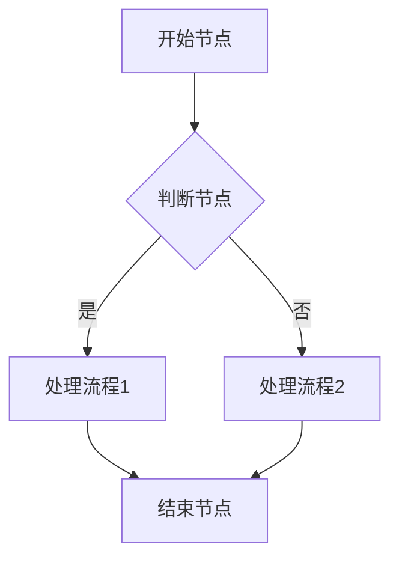

### 功能设计

#### 功能清单
<!-- 列出该系统的功能架构清单，包括一级功能、二级功能等 -->
| 系统编码 | 系统名称 | 一级功能编码 | 一级功能点 | 二级功能编码 | 二级功能点 |
| :--- | :--- | :--- | :--- | :--- | :--- |
|  |  |  |  |  |  |

#### [一级模块名称，例如：设备台账]

##### [二级模块/页面名称，例如：在用设备]

###### 功能描述
<!-- 描述该模块或页面的核心功能和业务目标 -->

###### 业务流程
<!-- 描述该模块内的具体业务流转过程，可包含流程图和流转说明 -->

###### 功能设计

####### [页面/弹窗名称，例如：在用设备列表]

**1. 页面原型**
<!-- 插入该页面的原型图或UI设计图 -->

**2. 功能说明**
<!-- 详细描述页面上的各个功能按钮、操作逻辑及数据流转规则 -->
- 查询：...
- 详情：...
- 编辑：...

**3. 页面控件**
<!-- 详细列出页面上的控件元素及其交互事件 -->
| 名称 | 类型 | 位置 | 事件 | 说明 |
| :--- | :--- | :--- | :--- | :--- |
|  |  |  |  |  |

**4. 页面字段**
<!-- 详细列出页面或表单中涉及的核心数据字段及其规则 -->
| 名称 | 数据类型 | 长度 | 允许操作 | 是否必输 | 录入方式 | 备注 |
| :--- | :--- | :--- | :--- | :--- | :--- | :--- |
|  |  |  |  |  |  |  |

####### [页面/弹窗名称，例如：新增在用设备]
（如上述结构重复，分别描述对应的原型、说明、控件与字段）
