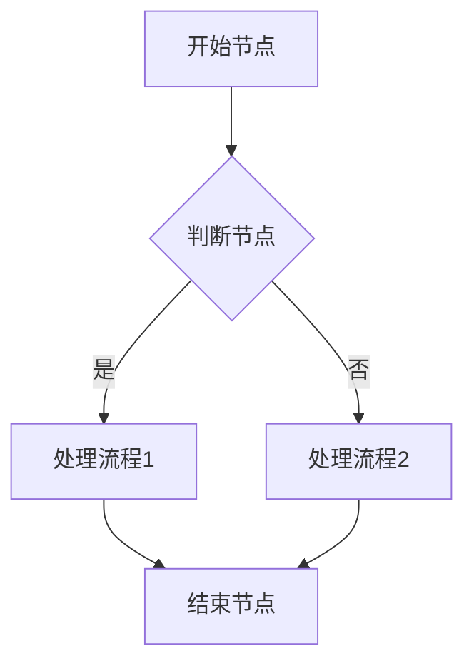

# [子系统/端名称，例如：PC端功能设计]

## [系统名称，例如：设备管理系统]

### 业务概况

#### 系统流程清单
<!-- 列出该系统涉及的核心业务流程清单表格 -->
| 序号 | 流程代码 | 流程名称 | 备注 |
| :--- | :--- | :--- | :--- |
| 1 |  |  |  |

#### 系统流程说明
<!-- 针对上述流程清单中的各个流程进行详细说明，可包含流程图和节点说明 -->

##### [流程名称]
<!-- 插入流程图 -->
<!-- 流程节点说明表格 -->
| 节点 | 主导部门 | 程序及事项 | 活动的具体要求 | 时限要求 | 产生文件、记录 |
| :--- | :--- | :--- | :--- | :--- | :--- |
|  |  |  |  |  |  |

### 功能设计

#### 功能清单
<!-- 列出该系统的功能架构清单，包括一级功能、二级功能等 -->
| 系统编码 | 系统名称 | 一级功能编码 | 一级功能点 | 二级功能编码 | 二级功能点 |
| :--- | :--- | :--- | :--- | :--- | :--- |
|  |  |  |  |  |  |

#### [一级模块名称，例如：设备台账]

##### [二级模块/页面名称，例如：在用设备]

###### 功能描述
<!-- 描述该模块或页面的核心功能和业务目标 -->

###### 业务流程
<!-- 描述该模块内的具体业务流转过程，可包含流程图和流转说明 -->

###### 功能设计

####### [页面/弹窗名称，例如：在用设备列表]

**1. 页面原型**
<!-- 插入该页面的原型图或UI设计图 -->

**2. 功能说明**
<!-- 详细描述页面上的各个功能按钮、操作逻辑及数据流转规则 -->
- 查询：...
- 详情：...
- 编辑：...

**3. 页面控件**
<!-- 详细列出页面上的控件元素及其交互事件 -->
| 名称 | 类型 | 位置 | 事件 | 说明 |
| :--- | :--- | :--- | :--- | :--- |
|  |  |  |  |  |

**4. 页面字段**
<!-- 详细列出页面或表单中涉及的核心数据字段及其规则 -->
| 名称 | 数据类型 | 长度 | 允许操作 | 是否必输 | 录入方式 | 备注 |
| :--- | :--- | :--- | :--- | :--- | :--- | :--- |
|  |  |  |  |  |  |  |

####### [页面/弹窗名称，例如：新增在用设备]
（如上述结构重复，分别描述对应的原型、说明、控件与字段）

### 数据库设计

#### 数据库表关系
<!-- 插入系统的核心数据库表ER图或实体关系图 -->

#### 数据库表清单
<!-- 列出该系统涉及的所有核心数据库表 -->
| 序号 | 表名 | 代码 | 所属模块 | 保存时长 | 备份周期 |
| :--- | :--- | :--- | :--- | :--- | :--- |
| 1 |  |  |  |  |  |

### 接口设计

#### 通讯协议
<!-- 描述系统接口的通讯协议，如HTTP, HTTPS, MQTT, TCP等 -->

#### 通讯策略
<!-- 描述通讯的方式和策略，如同步/异步，心跳机制，重试机制等 -->

#### 报文格式
<!-- 描述接口请求和响应的基本报文数据格式（如JSON, XML）及公共结构 -->

#### 接收数据清单
<!-- 列出系统作为服务端接收的数据接口清单 -->
| 序号 | 源系统 | 目标系统 | 接口名称 | 接口内容描述 | 频度 | 对应业务流程 |
| :--- | :--- | :--- | :--- | :--- | :--- | :--- |
| 1 |  |  |  |  |  |  |

##### 接口明细

###### [接口名称，例如：接口名称01]

**1. 接口说明**
<!-- 详细描述该接口的功能和业务场景 -->

**2. 接口参数**
<!-- 列出请求和响应参数详情 -->
| 序号 | 编码 | 类型 | 单位 | 为空 | 描述 |
| :--- | :--- | :--- | :--- | :--- | :--- |
| 1 |  |  |  |  |  |

#### 发送数据清单
<!-- 列出系统作为客户端发送的数据接口清单 -->
| 序号 | 源系统 | 目标系统 | 接口名称 | 接口内容描述 | 频度 | 对应业务流程 |
| :--- | :--- | :--- | :--- | :--- | :--- | :--- |
| 1 |  |  |  |  |  |  |

##### 接口明细

###### [接口名称，例如：接口名称01]

**1. 接口说明**
<!-- 详细描述该接口的功能和业务场景 -->

**2. 接口参数**
<!-- 列出请求和响应参数详情 -->
| 序号 | 编码 | 类型 | 单位 | 为空 | 描述 |
| :--- | :--- | :--- | :--- | :--- | :--- |
| 1 |  |  |  |  |  |
